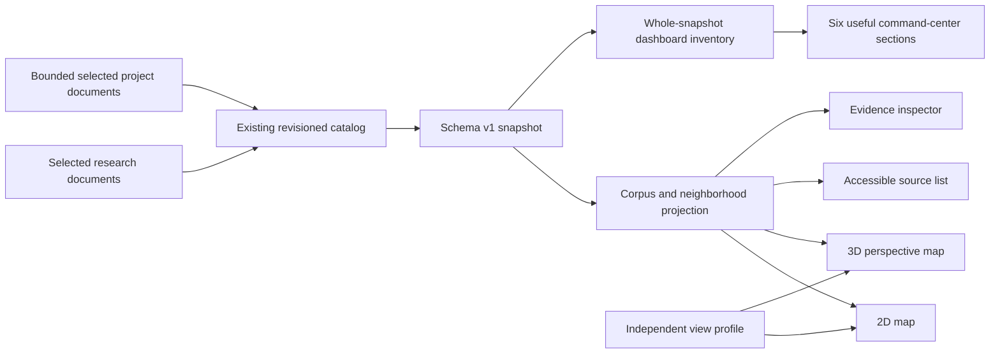
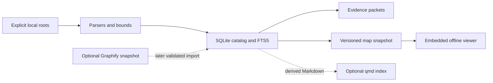

# Architecture

## Decision

Use pinned Bun 1.4.2, TypeScript, built-in SQLite with FTS5, and an authored SVG viewer.
Ship a target-specific executable with embedded viewer assets.
The Constellation and Orbital forms render up to 400 actual sources from the shared projection and retain the full searchable source list.
Atlas retains a 120-source spatial cap and up to twelve shared research citation representatives; other records remain accessible through the list and inspector.
SVG provides native source hit targets for this bounded release; larger graph rendering requires measured evidence before replacing the renderer.
Use ordinary source files as canonical content and SQLite as the revisioned derived catalog.
Accepted memory is canonical authored assertion state inside separately versioned optional memory tables, with captured evidence retained independently of source-index replacement.
The recommendation follows [primary-source research](research/architecture.md).

## Modules

| Module | Small interface | Responsibility |
|---|---|---|
| Ingestion | ingest explicit roots with bounds | Discover supported files, parse text and captions, retain locators, report skips |
| Store | replace a source revision, query a snapshot | Transactions, schema version, stable identifiers, chunk and search-index consistency |
| Retrieval | search query and scope | Literal FTS queries, bounded ranked snippets, citation and revision metadata |
| Collections | read an explicit manifest | Stable logical identities with local directory bindings and collision checks |
| Context | query to a budgeted packet | Source diversity, centered located excerpts, recorded paths and full output accounting |
| Memory | accept, recall, correct, retract, forget | Explicit namespace/lifecycle and retained cited spans; no automatic promotion |
| Module map | scoped indexed code to an outline | JS/TS syntax imports/export names, limited local target lookup and coverage |
| Catalog operations | status, backup, restore | Structural counts, consistent copy and fresh-target verified restoration |
| Presentation | render a versioned snapshot | Shared scoped projection, whole-snapshot dashboard inventory, pure placement/motion, 2D/3D camera, accessible source/evidence navigation |
| CLI | commands and JSON records | Validate arguments, handle errors, orchestrate modules, export and loopback preview |

## Selected UI direction

The [UI slice](SPEC.md#ui-design-slice-2026-10-03) deepens the presentation module rather than replacing the evidence core.
The highest test seam remains the versioned snapshot: source identity, revisions, locators, and relationship provenance enter there, and the same projection supports the map and accessible source list.
The research corpus and project-document corpus are real adapters to that seam; 2D and 3D are presentation implementations consuming the same evidence.
The projection module owns grouping, role labels, scoped counts, source filtering, and relevant recorded relationships so those rules do not leak into camera geometry or DOM drawing.
Its interface should stay small enough to exercise a full corpus-to-neighborhood-to-evidence journey without teaching callers the storage schema.
Constellation is the default role-cloud form, Orbital uses concentric role bands, and Atlas preserves the previous project-grid and neighborhood navigation.
The visible form switch and independent 2D/3D dimension control consume the same evidence projection.
Command center and Map are shell surfaces over that same projection rather than separate evidence applications.
Six divided dashboard sections use whole-snapshot inventory, clearly separated from filtered map counts, and call the existing source, corpus, layer, and coverage actions.
Reference geometry comes from the [cluster](../reference/visual-direction/rubric-clusters.png), [Rings](../reference/visual-direction/rubric-rings.png), and [Agentic OS arms](../reference/visual-direction/agentic-os-arms.png) images; they supply form rather than invented source records.

Depth comes from centralizing membership and provenance behavior at this seam, with locality for corrections and leverage for each presentation.
Apply the deletion test before extracting any additional helper: an interface that only renames another call earns no new module.
No general extension registry, app shell, graph engine, or worker scaffold is needed for this bounded design slice.
The existing source tree is already modular; add files only when they contain behavior exercised by this slice.
`viewer/projection.ts` owns corpus and evidence selection, `viewer/geometry.ts` owns deterministic Atlas placement, and `viewer/reference-geometry.ts` owns pure Constellation/Orbital placement.
`viewer/reference-scene.ts` translates those placements into role guides, actual source particles, and recorded relationship DOM targets.
It resolves overlapping pointer hit areas against the nearest projected source center without changing particle geometry, canonical identities, or keyboard targets.
`viewer/graph.ts` owns the shared camera and draw lifecycle; `viewer/render.ts` coordinates form controls, navigation, preference migration, and evidence panels.
`viewer/dashboard-model.ts` derives actual inventory totals, one-manifest-per-project shortlists, distinct citation/shared-URL rankings, skill records, and optional bounded coverage metadata through `createDashboardModel(snapshot)`.
`viewer/dashboard.ts` mounts the six sections once through `mountDashboard(snapshot, root, actions)` and exposes `update(state)`/`dispose()`; updates preserve focused DOM and delegate navigation to the existing viewer actions.
`viewer/motion.ts` owns movement eligibility, a pause-aware bounded elapsed clock, and reversible role/Atlas poses without browser dependencies.
`viewer/relationship-focus.ts` exposes `createRelationshipFocus(sourceIds, relations, selection)` with active state, shortest undirected distances, source opacity, and endpoint-minimum edge opacity.
Its bounded breadth-first traversal uses only valid canonical relationships inside the complete current corpus/group, before query/layer filtering, so hidden intermediates remain part of actual paths.
`viewer/graph.ts` applies the same focus result to real source groups, glyph-only bloom proxies, and evidence edges; role guides and illumination recede without changing source identity or geometry.
Selected relationships root the calculation at both endpoints, while Atlas's aggregate project overview disables source focus because its anchors are visual groups.
`viewer/reference-scene.ts` applies those poses to existing source and edge DOM targets; the shared graph lifecycle advances them in both 2D and 3D.
Unused earlier geometry, duplicate gesture handling, and obsolete collection state were removed rather than retained as a second rendering path.
The reference layout receives the complete unfiltered scope, so search, role filters, and ordinary source selection preserve unaffected positions.
Only recorded snapshot relationships create inspectable evidence edges; role outlines, bands, spokes, and Orbital label leaders remain organizational guides.
Orbital's inner-role labels use external callouts so labels do not displace source particles from their bands.

3D is a perspective projection of deterministic noncoplanar coordinates with an orbit camera and screen-facing labels.
It must not change source identity, citation text, relationship meaning, or the accessible evidence path.
It can use ordinary SVG drawing and local camera math at the existing bounded source limit; WebGL is not a requirement.
The [dated graph UI research](research/graph-ui-direction-2026-10-03.md) explains the 2D reading path and 3D tradeoffs.
The legacy single-circle layout remains a secondary Display option; it does not satisfy Orbital's concentric-band contract.
The default Command center uses two divided dashboard rails around the map; narrow layouts move the sections below the graph.
The separate Map surface retains its expanded canvas; Restore panels and Expand map change shell space and temporary panels rather than source identities or evidence.
Browser preferences use `tomeowl.display.v4` and validate the `surface` choice alongside form, scope, camera, effects, and layout.
One-time v3/v2 migration initializes the requested animated Command center and refits while retaining valid graph form and scope; reduced motion and High contrast override ambient movement.
Saved v4 pauses and zero speed survive reloads, and sound always starts off.
The validated `mapExpanded` boolean defaults to true and is included in saved view state, so restoring the rails persists across reloads.
Display reset preserves that panel choice.

The graph advances ambient motion at a bounded frame cadence without rebuilding scene DOM on each tick.
The clock clamps each active time step to 80ms and internal speed to the existing pace of 25, and it resets its prior timestamp on pause so hidden or paused intervals do not catch up.
The primary and Display sliders expose this as 0–100%, with zero still and 100% matching the previous pace.
Speed changes synchronize the clock and controls without rebuilding the scene.
One glyph-only SVG bloom surface and separate role illumination keep source hit targets, labels, and recorded edges unchanged; Glow off and High contrast hide these decorative layers.
Constellation movement stays within each role cloud; Orbital rotation preserves role bands and knowledge-sector gaps, while Atlas limits 2D jitter to overview/terminal nodes.
Selected sources or relations, hovered or keyboard-focused map targets, dragging, hidden pages, zero speed, reduced motion, and High contrast stop ambient movement.
The visible Pause/Resume action controls this lifecycle independently of glow and sound.
Explicit scene changes use cancellable 250ms opacity/blur transitions; dragging uses pointer feedback and a 180ms release settle without inertial camera drift.
Reduced-motion changes cancel transition effects and keep the interactive still view available.
Source/link selection settles emphasis from the prior displayed source opacity over 220ms except under reduced motion; this presentation settle is separate from paused ambient movement.
Actual source targets reveal on hover/keyboard focus, and Show all nodes clears selection without changing the current query, layer, or camera.
Cross-corpus research-source selection retains all research notes and citation records, rather than hiding the selected note's relationship endpoints in a note-only group.
No dashboard data service, animation dependency, extension registry, database change, or new runtime is required.

## Repository structure

Keep the headless domain, store, ingestion, retrieval, CLI, and actual adapters together under the existing source root.
Keep authored viewer modules together and regenerate the browser bundle through the project runner.
Keep focused behavioral fixtures in tests, generated local samples and before-copies in data, frozen prototype material in reference, current contracts in docs, and unimplemented capability proposals in docs/drafts.
The [domain glossary](../CONTEXT.md) defines corpus, collection, source, evidence, neighborhood, and relationship terms without implementation details.
The [local tracker](agents/issue-tracker.md) keeps decision records and one tracer-bullet file per implementation slice; it does not imply remote issues exist.
This structure separates current behavior, local user data, historical exploration, and future requirements without empty packages or speculative adapters.

## Invariants

Legacy source identity comes from normalized absolute path; manifest sources use stable collection ID and ASCII-folded relative logical path.
Content revision comes from SHA-256 of indexed UTF-8 content.
Replacing a revision replaces its chunks and FTS records, and an entire validated ingest commits source/FTS/relationship changes in one transaction.
Explicit file input never authorizes sibling pruning; only a complete unskipped directory scope can reconcile missing sources, including an empty scope.
Evidence records identify source, revision, chunk, and line or time locator.
Collections are presentation groups, not claims of semantic dependency.
An explicit source reference, lexical mention, imported edge, and inferred similarity must remain distinguishable.
No relationship is created merely because two items appear near each other on screen.
Every reference-form particle opens an actual scoped source; the central scope symbol and role frames are explicitly organizational anchors.

## Packaging and operations

Development compiles browser modules once and embeds their bundle as text in the CLI.
The shipped executable does not run a bundler or require Bun on PATH.
Use configurable database and output paths rather than installed machine paths.
Bind the optional preview only to loopback and run it in the foreground.
Use SQLite transactions and a busy timeout; do not copy a live database as a backup.
Probe FTS5 and reject unsupported schema versions instead of silently degrading or overwriting them.

## Deferred seams

Add PDF/OCR and domain parsers only with representative documents and locator tests.
Native retrieval uses the existing SQLite FTS5/BM25 store, shared exact collection/path scopes, bounded cited graph traversal, and quote/source/chunk-budgeted context assembly before adding an external provider.
The query-scope seam is shared by search, graph endpoints/evidence, and context metadata lookup; no separate graph/vector store or schema migration is introduced.
The graph module validates current indexed provenance in bounded adjacency queries, while the context module assembles native keyword results and recorded-path explanations without assigning semantic confidence.
The [native query guide](NATIVE-QUERIES.md) records result limits and freshness semantics independently of the frozen viewer.
Compare optional semantic providers, including qmd, only after a fixed query set demonstrates a native recall gap; no provider is mandatory for baseline retrieval.
The [native retrieval decision](research/native-retrieval-2026-10-04.md) records implemented behavior and the recommended next capability gate.
Graphify validation checks current sources and explicit imported provenance; persisting accepted records remains a later mutation.
Add harness interoperability through stable CLI JSON first; an MCP adapter can then reuse the same module interfaces.
The explicit memory interface now defines acceptance, supersession, expiry, retraction and owned logical forgetting; contradictory assertions remain separate with provenance.
Its optional memory schema version 1 does not change source catalog or viewer snapshot version 1, and read operations never initialize tables.
The [capability guide](CAPABILITIES.md) specifies captured-evidence retention, portable root rebinding, byte envelopes and module-map omissions.
Whole-source revision archives, legacy identity migration, automatic memory promotion and language-resolved symbol/call maps remain future work.
Parser behavior is tied to the first catalog schema; a parser change requires an explicit rebuild or a schema migration rather than assuming unchanged file bytes imply unchanged extraction.
Desktop packaging is optional; a local browser and offline export already cover the first workflow.

## Modernization direction

The dated [backend comparison](research/backend-options-2026-10-02.md) supports keeping SQLite as the default evidence core.
Optional vectors, grouping runs, and extraction candidates should be revisioned derived records rather than extensions to factual relations or viewer geometry.
The [modernization specification](drafts/MODERNIZATION-SPEC.md) defines proposed parser/worker/projection/view/export contracts, staleness rules, explicit Graphify promotion, portability requirements, and migration gates.
Saved view profiles and UI tokens remain independent of knowledge records so a renderer, dashboard, or internal application can change without rewriting evidence.
A second graph store or renderer is conditional on a measured query/scale requirement, and no such dependency has been adopted by this research pass.

## Proposed engineering evidence core

The [engineering evidence research](research/engineering-evidence-platform-2026-10-03.md) and [future specification](drafts/ENGINEERING-EVIDENCE-SPEC.md) extend the public product to literature, measurements, program structure, and reusable presentations.
These proposals do not change the current architecture or schema v1.
Keep the evidence catalog and FTS5 baseline, with distinct optional adapters for documents, columnar datasets, and source/configuration syntax.
Numerical datasets should retain typed observations and revisioned assets rather than be reduced to document chunks.
Program syntax should retain original spans and analysis assumptions rather than imply complete runtime semantics.

| Proposed seam | Contract | Initial direction |
|---|---|---|
| Ingest | Explicit inputs/config/bounds -> job and validated revision | Existing ingestion plus concrete format adapters |
| EvidenceQuery | Scope/query/limits -> citations, relations, coverage | Existing retrieval/catalog, incrementally extended |
| AnalyticalQuery | Dataset revision/approved recipe/predicate/bounds -> aggregate or batches | One optional numerical worker, selected by packaging and workload evidence |
| Project | Scoped references/view intent -> bounded versioned data | Renderer-independent map/chart/table/source views |
| Export | Projection policy/selection -> manifest and assets | Neutral schema first, dashboard templates downstream |

Future portable identities must be independent of absolute paths and preserve legacy mappings through a verified migration.
Richer typed locators identify pages/regions, sheet/cells, dataset records, and code spans only when their adapter can validate them.
Parser/config/model and analysis-run identities travel with evidence, and stale derivatives remain distinguishable from current results.
External assets activate through validated manifests so a database transaction does not falsely imply atomicity across files.
Apply scope before ranking, traversal, aggregation, grouping, and exports, including derivations that can reveal excluded inputs.

Views share typed scope/selection/cohort state with query generations, bounded results, and stale-response rejection.
Layouts/preferences remain separate from facts, and large numeric populations are projected as cohorts and aggregates.
Optional model or engine helpers remain offline-configured and do not download during ordinary startup.
The bounded M1/E0 viewer slice is delivered; broader core/analytics contracts are implemented only with their own fixtures and acceptance gates.
