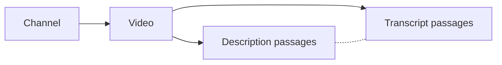

# Directed video archive graph

The Viberaven sample adds a Directed form to Tomeowl without changing the default presentation of existing workspace snapshots.
Its four role kinds are channel, video, description passage, and transcript passage.
Description and transcript passages are independent children of a video, so the ownership graph has three depths.



Solid arrows mean recorded containment.
Dashed links mean symmetric text overlap; they have no causal or ownership direction.
Selection uses the existing progressive relationship focus, full evidence inspector, motion speed, glow, 2D/3D camera, keyboard controls, and source list.
The map retains at most 400 source nodes while Explore retains the complete selected sample.

## Captured sample

The inspected archive has 41 channels, 4,298 videos/current transcripts, 4,275 nonempty descriptions, and 2,744,590 SQLite transcript segments.
The delivered [snapshot](../data/viberaven-2026-10-05-final/videos.snapshot.json) selects four channel folders and two videos per folder, yielding 44 nodes: four channels, eight videos, eight description passages, and 24 transcript passages.
It records 40 containment arrows and seven lexical links, with two current indexed citations per relation.
All seven observed lexical links connect a video's own description and transcript; this cohort does not demonstrate cross-video semantic discovery.
The complete archive is not indexed by this sample.
Discovery finds 16 JSON artifacts above the 2 MiB file limit and reports their omission while retaining the 4,298 discovered-video denominator.
Channel selection uses largest eligible folders, then stable video IDs, because almost all supplied publication values are relative labels rather than absolute dates.
Publication labels remain unchanged in metadata and are never silently converted to dates.

The source SQLite manifest was inspected read-only without WAL/SHM creation.
Raw JSON is the import input because description enrichment updates the raw artifact and video description while leaving the older transcript artifact BLOB unchanged.
No Viberaven source files or database records are modified.
The [inventory](../data/viberaven-inventory.json) records the inspected database and raw-artifact counts.

## Rebuild and view from CLI

Run from `D:\Dev\tomeowl` with Bun 1.4.2.
Choose a fresh output directory for each import.

```powershell
bun run sample:videos --root D:/Dev/viberaven/transcripts --out data/viberaven-demo-002 --channels 4 --videos-per-channel 2
bun scripts/preview-workspace.ts --snapshot data/viberaven-demo-002/videos.snapshot.json --html data/viberaven-demo-002/videos.html --port 4321
```

Open `http://127.0.0.1:4321/` for the live preview and stop the foreground server with Ctrl+C.
The generated HTML also opens directly offline and contains all selected quotes, graph data, JavaScript, and CSS.
The preview remains loopback-only.
The recipe supports one to eight channels and one to three videos per channel, with a maximum of 24 videos.
It accepts the explicit `<channel>/<video-id>/transcript.json` archive layout, including embedded description and timed snippets.
Legacy flat archives and a direct SQLite import mode are not implemented.

## Chunking, retrieval, and relations

The QMD-inspired splitter uses a 3,600 UTF-16-character ceiling and approximately 540 characters of description overlap, with paragraph/sentence boundaries preferred near the end.
Unicode surrogate pairs are preserved at every split.
Transcript chunks respect complete cue boundaries and reuse whole cues up to 540 characters where possible; an oversized cue is split without losing its original timestamp or ordinal.
This is a character approximation, not QMD's model tokenizer, embedding inference, or identical retrieval ranking.

Each channel, video, and passage has a stable archive identity and an independently indexed record in the generated Tomeowl SQLite catalog.
Native FTS5 search retrieves the complete selected passage bodies without QMD, Graphify, or a model.
For example:

```powershell
bun src/cli.ts search --db data/viberaven-2026-10-05-final/videos.sqlite --query embeddings --limit 5
```

The `qmd` output folder contains Markdown projections using Tomeowl's existing QMD adapter and can be admitted to an optional isolated QMD collection.
QMD has not been run on this corpus.
The graph follows Graphify's provenance-oriented approach, but Graphify document extraction has not been run and requires a model backend.
The code-only AST extraction mode cannot create semantic transcript relations.
The [primary-source research](research/viberaven-directed-graph-2026-10-05.md) distinguishes these paths.

Cross-links use native TF-IDF token cosine, at least three shared terms, a score threshold of 0.28, and at most two links per passage.
Common boilerplate and high-frequency terms are excluded, and same-video passage pairs of the same role are excluded to avoid treating overlapping captions as discoveries.
Candidate comparison is bounded to 200 candidates per passage and the selected corpus to 2,048 passages.
The displayed cosine score is a lexical score, not a confidence probability or embedding similarity.

## Evidence and portability

The output directory contains `videos.sqlite`, `videos.snapshot.json`, `videos.html`, `provenance.json`, per-node `records`, and QMD Markdown projections.
Source revisions hash the generated indexed bodies, while separate raw-artifact and full-description hashes identify the original inputs.
Description record citations use actual generated-record line numbers; original description field offsets, line bounds, and the full description hash remain in source metadata.
Original description offsets are half-open UTF-16 offsets, and transcript cue ordinals are zero-based.
Transcript citations retain start/end seconds, original cue spans, video IDs, caption language, and known generated-caption status.
Unknown caption generation status remains unknown.
Containment relations cite both the parent metadata record and the child passage, rather than presenting passage text alone as proof of ownership.

The source artifacts stay canonical and are required to reproduce their original raw JSON, while the generated catalog and HTML are captured derivatives.
Catalog freshness checks verify generated records, not subsequent changes in Viberaven's original archive.
To refresh source content, rebuild into a new output directory and compare raw hashes.
Plain catalog export does not recover the enriched media metadata; use the captured media snapshot or rebuild this recipe.
On another machine, copy Tomeowl's source, supply that machine's archive root, and rebuild with the same CLI recipe.
Node IDs survive a moved archive/output directory, while local source paths are recreated for the new machine.

## Embedding decision

Ownership and transcript order do not need embeddings because archive IDs and timestamps provide those facts directly.
Add an optional encoder later for paraphrase retrieval, inter-video topic grouping, and similarity coloring, evaluated against the lexical baseline.
Embedding similarity should become a separate labelled relation/lens, retaining model identity and source revisions rather than replacing ownership arrows.
No model, vector index, renderer dependency, or hosted service is added by this slice.
