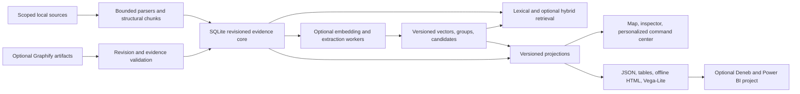

# Semantic command center modernization specification

Status: proposed next-release requirements, researched on 2026-10-02; none of the new capabilities below is implemented by this document.
This specification develops the [platform vision](PLATFORM-VISION.md) into concrete UI, data, integration, and delivery requirements.
The [release specification](../SPEC.md) and [status](../STATUS.md) continue to describe the shipped baseline.
The [UI design slice added on 2026-10-03](../SPEC.md#ui-design-slice-2026-10-03) is the concrete current execution contract for M1/E0, including project/research corpora and optional 3D perspective.
This draft retains the broader staged proposals and is not the source of implementation-completion claims.

**Public engineering extension, 2026-10-03:** [ENGINEERING-EVIDENCE-SPEC.md](ENGINEERING-EVIDENCE-SPEC.md) adds literature, measurement, and read-only program workflows, richer evidence contracts, and coordinated analytical views.
Its E0 gate is the M1 slice below; its later gates are independent capability work rather than additions to the next UI task.
The dated [engineering platform research](../research/engineering-evidence-platform-2026-10-03.md) records the new backend/frontend candidates and deployment uncertainties.

## Outcome and recommendation

Make Tomeowl a visually compelling, personalizable evidence workspace whose knowledge can also feed other internal tools and management reports.
Prioritize recognizable groups, meaningful layers, readable evidence, and stable navigation before changing the database or adding a generative model.
Keep the current TypeScript/Bun, SQLite, and offline viewer foundation; add replaceable derived capabilities incrementally.
Use Graphify as an optional extraction input, compact embeddings for discovery, and task-specific classifiers before evaluating a larger local reasoner.
Benchmark an embedded graph database only against a named query that the existing store cannot serve adequately.

The earlier 7/10 rating was a product-direction signal rather than a measured usability score.
The latest request rates the build 4/10 and sets an independent 9/10 review target under the current UI slice's rubric.
The goal is an attractive management demonstration backed by a useful daily engineering workflow, with a shared evidence contract across both.

## Assumptions and feasibility

The provisional target is one Windows x64 user with CPU inference available, no administrator installation, staged offline assets, and a supported modern browser.
Hardware, corpus size, allowed model packages, company distribution rules, and Power BI tenant policy remain unknown.
These assumptions allow useful prototypes now; production promises depend on target-machine evidence.

| Idea | Feasibility | Recommended decision |
|---|---|---|
| Strong grouping, layering, distinct colors, saved views | High within the current viewer | First implementation milestone; no model or graph DB needed |
| Query/selection similarity heat layer | High with approved embeddings | Optional derived feature; compare models and clearly name the reference point |
| Automatic topics and nested communities | Conditional on usable metadata, edges, or embeddings | Compare manual tags, structural groups, topology, and semantic neighborhoods separately |
| Attractive motion and command-center effects | High at bounded scale | Use purposeful transitions, selection accents, and a presentation profile with a frame budget |
| Zero-service graph backend | Already partly available through SQLite edges | Prove adjacency/path queries first; benchmark LadybugDB if traversal becomes a bottleneck |
| OpenJev fixed-option classification | Possible on Windows, but its documented 4B setup is substantial | Use as a scoring reference; compare rules and compact classifiers first |
| Small Gemma extraction/reasoning | Possible with a supported runtime and suitable checkpoint | Optional worker with constrained outputs, evidence validation, timeouts, and abstention |
| Knowledge reused in another dashboard | High with versioned JSON/tables | Define export contracts early; keep renderer and storage details private |
| Power BI/Deneb/PBIP integration | Technically plausible, environment-dependent | Tables and Vega-Lite first; validate a Desktop-authored project as a downstream artifact |
| Own code eliminates license concerns | Only partly | Own the orchestration and schema; still inventory reused code, models, dependencies, and assets |
| Large multiuser corporate graph platform | Larger architectural change | Separate future service profile with real authorization, concurrency, and operations requirements |

Primary-source candidate comparisons and limitations are in [backend research](../research/backend-options-2026-10-02.md) and [UI/interoperability research](../research/ui-interoperability-2026-10-02.md).

## User tasks

| User | Task | Successful result |
|---|---|---|
| Engineer | Find material about a topic across selected projects | Ranked evidence with usable source locators and a visible scope |
| Engineer | Understand why two sources appear related | Both supporting passages plus the relationship method, status, and score meaning |
| Engineer | Explore a large collection | A small group overview, expandable neighborhoods, and an accessible source list |
| Engineer | Resume a personal workspace | The selected view, filters, camera, and presentation preferences are restored |
| Presenter or manager | Understand a project in a short demonstration | Readable topic/dependency views, real counts, freshness, gaps, and evidence drill-down |
| Integrator | Reuse the knowledge in another app | Versioned records/tables without parsing HTML or reading private database tables |

## UI requirements

| ID | Priority | Requirement and acceptance behavior |
|---|---|---|
| MAP-01 | P0 | Provide overview, neighborhood, and evidence levels; expansion has breadcrumbs and preserves selection |
| MAP-02 | P0 | Distinguish collection, topic/group, source, and later entity nodes using size/shape/labels as well as color |
| MAP-03 | P0 | Supply stable categorical colors and a visible legend; color modes are explicit and persist with the view |
| MAP-04 | P0 | Show recorded relations, extraction candidates, and similarity separately; users can filter each class |
| MAP-05 | P0 | Keep meaningful group names and representative labels visible at overview zoom without overlapping all source labels |
| MAP-06 | P0 | Preserve layout for unaffected nodes across ordinary filtering, selection, and source updates; recomputation is an explicit action |
| MAP-07 | P0 | Present readable evidence excerpts while preserving raw source text and original locators |
| MAP-08 | P1 | Support collection and manual-topic grouping offline; add computed grouping with its method and coverage disclosed |
| MAP-09 | P1 | Offer an optional similarity heat layer with a selected source/query reference, score legend, no-score state, and inspectable evidence |
| MAP-10 | P1 | Provide a bounded pairwise comparison matrix for a chosen subset rather than an all-corpus matrix |
| VIEW-01 | P0 | Save named Engineer and Presentation presets, plus theme, color mode, filters, layout, labels, camera, glow, and motion |
| VIEW-02 | P0 | Provide dark command-center, calm/light, and high-contrast options through shared design tokens |
| VIEW-03 | P0 | Keyboard/list navigation, visible focus, reduced motion, zoom, and text alternatives convey the same meaning |
| VIEW-04 | P1 | Presentation mode uses deliberate transitions and real coverage/freshness summaries; it can freeze the layout and export that pose |
| VIEW-05 | P1 | Keep primary controls for scope, search, view, and evidence visible; place orbit/glow/sound/effect settings in personalization |
| VIEW-06 | P1 | Support optional panels with independent data providers; show unavailable or empty states when a provider is absent |

### Visual hierarchy and grouping

Use three levels: workspace/project or collection overview, topic/community neighborhood, and individual evidence-bearing source.
Allow topic groups to cross collections while keeping source ownership and scope visible.
Group membership may be many-to-many; a default primary group must not erase secondary memberships.
Unassigned and singleton sources remain reachable.
Do not add invented entity types or ARMS categories to the current source-only corpus simply to fill the screen.
ARMS can become a navigation preset when real application, routine, memory, and skill records exist.

Use larger labeled aggregate nodes or restrained group hulls with counts at overview scale.
Expand locally, fade unrelated edges, and retain enough context to navigate back.
Support a dependency/workflow view for directed questions, separately from a topic map.
Store display labels, aliases, manual tags, and saved positions outside immutable source bytes.

### Color and heat semantics

The default color mode is categorical group color, with neutral chrome and a strong selection outline.
A similarity mode temporarily uses a sequential perceptually ordered scale for a specific selected item or query.
Show its reference, model/run, compared unit, numerical score, and threshold in the legend or details.
Do not suggest that every pairwise similarity can be compressed into one globally meaningful node hue.
A missing vector is an explicit no-score state, not the lowest similarity value.
Similarity is a ranking signal; it is not a probability of truth, importance, agreement, or a verified relationship.
Use a text badge or line style for relationship status and a distinct shape for source type.
Keep confidence, importance, freshness, source type, and similarity as separate attributes; avoid mapping all of them to brightness.
Categorical colors remain stable across reloads, and manual overrides travel with a view preset.
Cluster colors are assigned through stable group identities; recomputed memberships disclose their run and changed coverage.

### Motion and special effects

Prioritize smooth group expansion, selection emphasis, camera movement, and panel transitions over continuous movement of reading targets.
Provisional transition durations are 160-240 ms for controls and 250-400 ms for group/camera changes, subject to task testing.
Pause ambient movement during evidence reading, selection, dragging, keyboard focus, and hidden-tab periods.
Use small cached glows, restrained depth, and a single animation clock; cancel superseded transitions and suspend unused work.
Presentation mode may enable slow ambient effects, while Engineer mode starts with stable spatial targets.
Reduced-motion mode has instant or minimal transitions with no ambient motion; sound remains off by default.
Effects have a quality setting and a complete off switch, and exported reports retain meaning without animation.

## Semantic pipeline requirements

| ID | Priority | Requirement |
|---|---|---|
| SEM-01 | P0 | Chunk by document structure and hard bounds first; preserve headings, line/time spans, parser version, and chunker configuration |
| SEM-02 | P0 | Store embeddings by source revision, chunker identity, model artifact hash, tokenizer/prompt configuration, dimensions, and metric |
| SEM-03 | P0 | Mark derived results stale when any input changes; rebuild into a staging index and activate only a complete compatible run |
| SEM-04 | P0 | Filter scope before ranking, traversal, grouping, summaries, or export; excluded sources must not affect visible aggregates |
| SEM-05 | P1 | Compare lexical, semantic, and hybrid retrieval on the same held-out queries; preserve component rankings and evidence lineage |
| SEM-06 | P1 | Build bounded semantic neighbors with top-k/threshold limits, stable tie handling, and inspectable contributing chunks |
| SEM-07 | P1 | Store groups separately from claims, with membership, method, seed/parameters, input subset, and run metadata |
| SEM-08 | P1 | Classification supports unknown/abstain, multitag cases, and user correction; raw model scores are typed, not presumed calibrated |
| SEM-09 | P2 | Extract only schema-valid relationship candidates with source spans; explicit reviewed promotion and retraction preserve history |
| SEM-10 | P2 | Apply graph expansion or summaries only when they improve the target question over simpler retrieval |

### Staged computation

1. Parse and chunk deterministically with bounded format adapters.
2. Apply exact links, syntax/code structure, rules, and manual tags.
3. Optionally compute embeddings for retrieval, neighborhood discovery, and clustering experiments.
4. Optionally classify/extract spans with a compact encoder or task-specific model.
5. Escalate ambiguous bounded inputs to a small generative model only when evaluation shows a benefit.
6. Validate IDs, scope, revision, allowed labels, source spans, resource limits, and output schema before retaining candidates.

“System 1” and “System 2” are design labels for a routing policy here, not promises about human-like reasoning or a model's reliability.
OpenJev scores supplied options; it does not supply chunk boundaries or a relationship ontology.
A compact classifier can handle fixed labels, while a generative worker can propose structured outputs for cases the classifier cannot express.
Models do not replace parser locators or evidence validation.
See the dated backend report for Gemma 3, Gemma 4, embedding models, and their different artifact licenses.

### Similarity and clustering experiments

Start with chunk embeddings and compare document-level pooling versus representative chunk neighborhoods.
Retain the winning chunk pairs so a source-level score can be explained; bound per-source contributions to avoid long documents dominating results.
Compare a topic hierarchy based on manual tags or headings with connected components on recorded edges and a separate semantic k-nearest-neighbor graph.
Topology-based communities and semantic communities must record which graph they used.
There are zero recorded relationships in the current 33-source review snapshot, so topology alone cannot discover meaningful communities there.
For semantic graphs, compare directed top-k and mutual-neighbor edges on labeled pairs; do not pick a universal cosine threshold from intuition.
Cap neighbor candidates at O(nk) retained records; avoid persisting or rendering O(n squared) all-pairs output.
Exact cosine scans can establish a small-corpus baseline, but large all-neighbor construction needs separate time/memory bounds or an evaluated approximate index.
Projection coordinates such as [UMAP](https://arxiv.org/abs/1802.03426) are exploratory geometry; a 2D distance does not preserve every high-dimensional similarity or become an edge.

## Architecture and contracts



The arrow from validated artifacts to the core describes a future explicit import command; today's Graphify command only validates.
Keep business meaning in the domain/projection contract, rendering in the viewer, and extraction/runtime decisions in workers or adapters.
Do not introduce a general plugin framework until a second working implementation demonstrates the interface needs.

| Boundary | Small contract | Failure behavior |
|---|---|---|
| Parser/chunker | Bounded source bytes to located blocks with versions | Report unsupported/partial input; never silently claim complete extraction |
| Embedding worker | Versioned text batches to vectors plus model metadata | Timeout/cancel, structured error, no implicit download, FTS remains usable |
| Extractor | Located chunks to labels/entities/relation candidates | Schema/span validation and abstention; no direct canonical writes |
| Graph access | Scoped neighbors/path query to evidence-bearing records | Explicit budgets and truncated status; optional derived engine can rebuild |
| Projector | Authorized scope plus snapshot version to neutral records | Reject unsupported schema and stale inputs or disclose them explicitly |
| Viewer | Snapshot plus independent view profile to interactions | Accessible list/table fallback and bounded rendering |
| BI exporter | Snapshot plus export policy to tables/spec/manifest | Validate row counts, identifiers, types, classification, and omitted fields |

### Proposed versioned records

Keep the current schemaVersion 1 usable; publish a separate versioned extension or schemaVersion 2 when implementation actually adopts new fields.
The current `similar` relation kind must not become the default container for embedding scores.

| Record | Minimum additions |
|---|---|
| Evidence snapshot | Snapshot ID, producer/version, scope, generation time, schema version, revision coverage, truncation/staleness |
| Group | Stable ID, label, kind, optional parent, memberships, method/run, source subset, parameters, manual overrides |
| Similarity record | Endpoints, contributing chunks/revisions, score/metric/unit, embedding run, k/threshold; separate from assertions |
| Extraction candidate | Typed predicate, direction, endpoints, exact evidence spans, method/model/run, review status, score semantics |
| Accepted assertion | Separate acceptance/retraction lifecycle, evidence, actor/action history, scope, current/stale state |
| View profile | Own schema version, snapshot compatibility, theme/tokens, filters, color mode, label policy, layout/seed/positions, camera, effect settings |
| Export manifest | Schema versions, producer, input snapshot, counts, scope/redaction policy, file hashes, model/run metadata where relevant |

Do not conflate an extraction method (`structural`, `imported`, `model`) with acceptance status (`candidate`, `accepted`, `retracted`) or current revision validity.
Only fields actually supported by a record type are required; the source-only baseline must not fabricate entities or assertion history.

## Portability, robustness, and licensing

| ID | Priority | Requirement |
|---|---|---|
| PORT-02 | P0 | Ship a useful core with no model, Python installation, mandatory service, administrator privileges, or first-run network access |
| PORT-03 | P0 | Optional capabilities are separately staged packages with exact versions/hashes, notices, and explicit offline selection |
| PORT-04 | P0 | Paths and output locations are configurable; exports do not assume the original machine's drive letter or username |
| PORT-05 | P0 | Backups use a consistent SQLite backup/closed-database method; schema upgrades preserve a verified rollback artifact |
| PORT-06 | P0 | Jobs have item/byte/time/memory limits, cancellation, structured summaries, explicit exit codes, and resumable/rebuildable derived output |
| PORT-07 | P1 | Export a relocatable source manifest and explicitly rebind source roots without silently changing IDs or merging duplicate content |
| PORT-08 | P1 | Test missing models/extensions, blocked WebGL, restricted DLL loading, long paths, Unicode paths, and read-only destinations |
| LICENSE-01 | P0 | Record direct/transitive code, model/tokenizer, parser, font/icon, and runtime terms for exact distributed artifacts |
| LICENSE-02 | P0 | Keep Tomeowl-authored contracts and UI separate from optional integrations; retain required notices for reused code/assets |

Original files remain authoritative; accepted manual annotations and review decisions are valuable user data and must also be backed up.
Derived vectors, communities, generated labels, and layout caches are rebuildable; they must never become the only copy of a user's correction.
The current IDs depend on normalized absolute paths, so relocation requires an explicit identity mapping design rather than simply copying the catalog.
Do not use a content hash alone as source identity: distinct files can have identical bytes.
Keep user-space deployment separate from guarantees about employer approval or application-control policy.
No API bill is a cost objective; it does not mean zero CPU, disk, maintenance, inference latency, or license obligations.
A future shared backend needs authentication and enforceable authorization before any use of confidential data; UI scope filters alone are insufficient.

## Interoperability and management reports

| ID | Priority | Requirement |
|---|---|---|
| EXPORT-01 | P0 | Versioned JSON and typed nodes, edges, memberships, and evidence tables preserve IDs, revision lineage, direction, and status |
| EXPORT-02 | P0 | Export policy selects scope and permitted fields; default management exports omit raw vectors, long quotes, and private absolute paths |
| EXPORT-03 | P1 | Provide one Vega-Lite summary projection with a pinned schema/runtime and locally bundled dependencies |
| EXPORT-04 | P1 | Verify a Deneb visual with the same table fixtures and reconciled counts in the target Power BI Desktop/tenant |
| EXPORT-05 | P2 | Use a Desktop-authored PBIP/PBIR project template only after a validated report need; keep it downstream of neutral contracts |

Recommended tables are Sources, Groups, Memberships, Relations, Evidence, and optional Similarity, with unique keys and an export manifest.
Bridge tables prevent duplicated memberships or evidence from inflating source/relationship counts; use explicit distinct-count measures.
Separate knowledge snapshots from time-series operational metrics and record metric definitions and measurement windows.
Show source coverage, current/stale records, reviewed/candidate relations, and supported group sizes; never use a model score as a “knowledge quality” percentage.
Vega-Lite supports summary charts; a full force-directed graph may need precomputed coordinates and Vega or a dedicated renderer.
Deneb uses a Power BI dataset projection, not arbitrary access to Tomeowl's database or local source files.
PBIP/PBIR report definitions are not a drop-in way to embed Tomeowl's complete animated HTML viewer.
Power BI report metadata and bookmarks can themselves contain data values, so field redaction also applies to project artifacts.
Technical format support and tenant availability must be checked on the exact supported Power BI version.

## Delivery order

| Stage | Bounded deliverable | Evidence required before expansion |
|---|---|---|
| M0 | Current-state UX assessment and fixed public fixtures | Current limits documented; before captures and task scenarios retained |
| M1 | Current renderer with grouped overview, categorical colors, readable inspector, stable expansion, and saved Engineer/Presentation views | Keyboard/offline/reduced-motion checks and task evidence; no backend/model dependency |
| M2 | Optional local embeddings, selected-item heat layer, and explainable neighbors | Compare small encoders, retrieval quality, pair precision, CPU/RAM/disk, staleness and missing-model fallback |
| M3 | Versioned JSON/table export and one Vega-Lite/Deneb report fixture | Counts/provenance reconcile and target environment opens it offline as supported |
| M4 | Compact classification and candidate extraction on reviewed fixtures | Rules-versus-model comparison, span correctness, abstention, resource limits, reversible review workflow |
| M5 | Renderer or graph-engine scaling spike only when required | Same data/query baseline, measured improvement, clean-machine packaging, license inventory |
| M6 | Corporate pilot or additional internal-app projection | Approved artifacts/data scope, enforceable access boundaries, restore/rebuild exercise, target-machine validation |

M1 is the recommended next coding slice.
M2 and M3 are independent after the relevant contracts exist; M4 does not block a credible presentation.
Durable agent memory, broad harness ingestion, and unrelated dashboard panels remain separate future work.

### Provisional acceptance targets

Targets below are proposed engineering budgets, not current measurements or commitments for unspecified hardware.
Record Windows/browser/hardware, package/model hashes, corpus, settings, cold/warm runs, median/p95, and peak memory.

| Area | Proposed gate |
|---|---|
| Comprehension | At least 4 of 5 pilot participants complete topic finding and evidence inspection without assistance; all distinguish similarity from a recorded link |
| Group overview | The current 33-source fixture and 1k-source fixture have readable group labels, an unassigned path, no lost sources, and reconcilable counts |
| Interaction | On the recorded reference laptop, p95 selection feedback below 100 ms and pan/zoom frame time below 33 ms at the claimed size |
| Load | Offline 1k-node bounded view becomes interactive within 2 s on the reference laptop; record total HTML/bundle size and memory |
| Retrieval | On at least 50 held-out queries, hybrid beats the FTS baseline on paraphrase recall/nDCG without lowering exact-identifier success or citation validity |
| Similarity | On at least 100 reviewed pairs, report precision@k, false positives, coverage, and threshold sensitivity; tune acceptance to the intended discovery task |
| Extraction | Reject schema-invalid/out-of-scope/stale evidence in every fixture; report candidate precision/recall and abstention separately, with no silent promotion |
| Stability | Reloading a saved view restores positions/camera; selecting or toggling labels does not recompute layout; source updates expose stale derived runs |
| Export | JSON/table counts reconcile; IDs and evidence locators survive a round-trip; disabled fields do not appear in data or report metadata |
| Restricted machine | Useful core runs without Bun on PATH, administrator install, network, model pack, or WebGL; optional capabilities fail clearly and leave core usable |

Stress-test 5k/10k visible nodes and 10k/50k chunks separately before increasing a supported size.
Keep the current spatial limit until a renderer change actually passes the agreed target workload.

## Codex or Claude implementation workflow

Use one task-specific living plan per stage with a behavior goal, inputs, file scope, decisions, progress, rollback, and acceptance evidence.
Keep this specification and source reports as references; avoid putting the whole research corpus into every agent's instructions.
The official [Codex modernization workflow](https://developers.openai.com/cookbook/examples/codex/code_modernization) uses a bounded pilot, design, validation, and execution plan.
The current [Claude instruction documentation](https://code.claude.com/docs/en/memory) documents version/settings-dependent AGENTS.md loading and a CLAUDE.md import fallback; verify loading instead of assuming the harnesses are identical.
No runtime use of a coding agent, hook framework, or cloud API is required by the shipped app.

Suggested next task prompt:

```text
Implement only M1 from docs/drafts/MODERNIZATION-SPEC.md.
Read PRODUCT.md, DESIGN.md, docs/SPEC.md, and the current UI assessment.
Inspect current viewer modules and preserve the source/evidence contract.
Create a bounded implementation plan and baseline captures for the 33-source fixture.
Add overview/neighborhood/evidence levels, stable group colors and labels,
readable excerpts, and named Engineer/Presentation presets with offline persistence.
Keep the current renderer and package set unless a measured blocker requires a decision.
Verify keyboard, reduced motion, empty/dense states, snapshot injection safety,
saved-state recovery, desktop/mobile layout, and the existing release checks.
Update affected docs and report measured results and remaining limitations.
```

For M2, first ask for a public fixture evaluation of the embedding candidates in the backend report, with no production corpus and no model becoming mandatory.
For M3, first prove one neutral table bundle and one report fixture before generating additional dashboard templates.
Delegate scoped work when the requested model and applicable instructions permit it, with disjoint file scopes and one integrator for shared contracts.

## Research boundary

This specification is a synthesis of the user's ideas, local code/screenshot review, and linked primary-source research.
No graph database, model runtime, renderer, or Power BI adapter was installed or benchmarked during this research pass.
The recent community sweep had limited coverage and does not establish a dominant industry practice or SOTA winner; see [recent-practice notes](../research/recent-practice-2026-10-02.md).
