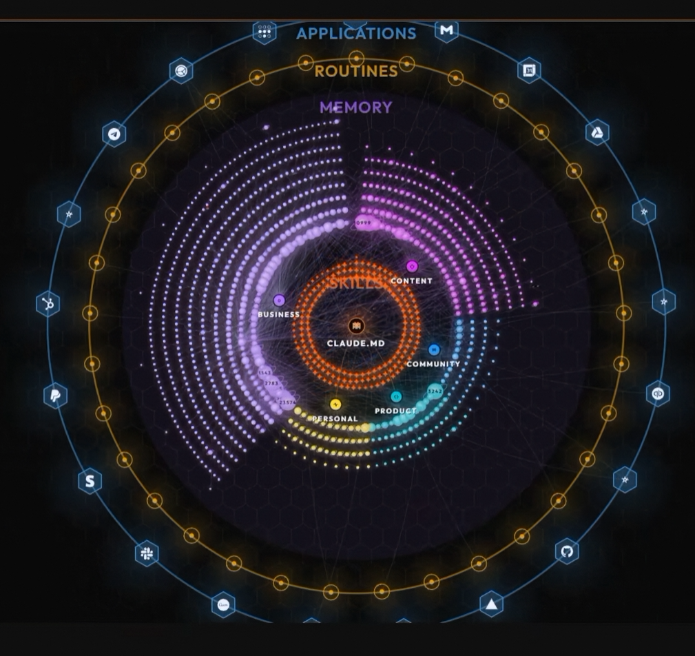
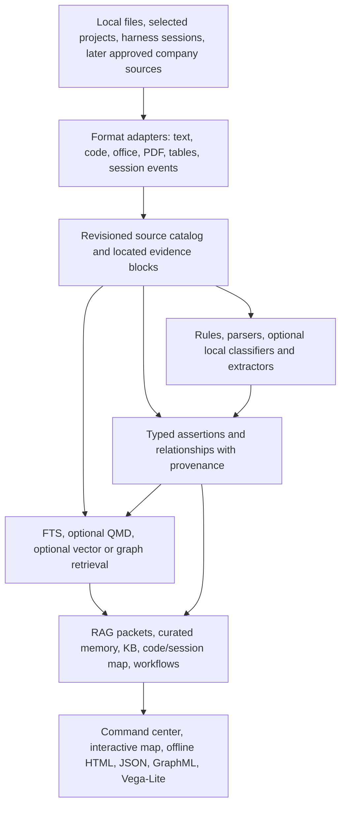

# Tomeowl platform direction and requirements draft

**Status:** research draft for discussion; not an approved implementation plan.
**Date:** 2026-10-02.
**Scope:** product boundaries, architecture direction, portability, integrations, and presentation.

The user's subsequent UI/backend brainstorm is developed in the [modernization specification](MODERNIZATION-SPEC.md), with detailed requirements, feasibility, data contracts, and M0-M6 delivery gates.
That specification makes UI grouping, layering, personalization, and evidence readability the recommended next slice rather than waiting for a larger backend rebuild.
The subsequent public [engineering evidence specification](ENGINEERING-EVIDENCE-SPEC.md) extends the vision to literature review, semiconductor measurement analytics, read-only program analysis, and linked graph/chart/table/source workflows.
Its dated [research report](../research/engineering-evidence-platform-2026-10-03.md) compares portable core and interactive frontend options without adopting new dependencies.

## Product direction

Tomeowl should be a local-first evidence platform that can project the same trusted source material into several useful experiences: cited RAG, curated agent memory, a navigable knowledge base, code/session maps, and workflow or management views.

The product should let one project, such as Farseer, query sessions from its connected harness and optionally include read-only sessions from other local harnesses, while also letting a user build a broader catalog across selected `D:\Dev` projects.

The architecture must keep originals recoverable, evidence traceable, integrations replaceable, outputs interoperable, and the ordinary workflow usable without a model, a remote service, or administrator installation.

The long-term presentation goal is a configurable command center with an impressive but legible interactive map, useful operational panels, polished motion, and portable exports; presentation should consume stable data contracts rather than own the knowledge model.

This is a personal and enterprise-adaptable direction, not a claim of workplace approval or a promise that every input format can be processed by one standalone executable.

## Draft requirements

These requirement IDs are proposed review anchors, not approved release commitments.

| ID | Priority | Requirement |
|---|---|---|
| CORE-01 | Must | Index only explicitly configured local sources by default; source discovery, inference, export, and writes must be visible operations. |
| CORE-02 | Must | Every returned evidence item must identify its source revision and a usable locator, and the original source must remain the recoverable authority. |
| CORE-03 | Must | RAG, memory, knowledge-base, mapper, and workflow experiences must reuse shared identities without collapsing their distinct lifecycle and trust semantics. |
| GRAPH-01 | Must | Every relation must retain its type and provenance; an inferred candidate, visual cluster, or proximity must not be represented as an accepted fact. |
| MEM-01 | Must | Memory promotion, correction, supersession, and forgetting must have explicit, reversible behavior and retain permitted evidence lineage. |
| PORT-01 | Must | The baseline CLI and offline viewer must work without a mandatory model, remote service, administrator install, or third-party runtime beyond the target-specific executable. |
| EXT-01 | Must | Retrieval, parser, harness, graph, and presentation integrations must use versioned public contracts instead of private database schemas. |
| INT-01 | Must | Harness imports must be scoped, read-only by default, and preserve original session IDs and source timestamps. |
| GOV-01 | Must | Source scopes and classification rules must apply before retrieval, traversal, aggregation, and export. |
| UX-01 | Should | Users should be able to save and personalize panels, filters, layouts, and visual preferences separately from canonical knowledge. |
| UX-02 | Should | Motion should be controllable, reduced-motion preferences honored, sound disabled by default, and core navigation usable by keyboard. |
| XCHG-01 | Should | Versioned JSON is the baseline interchange; GraphML, offline HTML, Vega-Lite, and Power BI adapters may be added as validated projections. |
| MODEL-01 | Should | Classifiers and extractors must be optional, locally configurable, auditable, and evaluated for uncertainty and domain-specific errors before promotion. |

## Boundaries for the next review

Use these IDs as broad product context, the modernization specification as the concrete next UI scope, and the engineering evidence specification for later capability gates.

Do not treat a future company integration as permission to index company information; data access, confidentiality, packaging, and legal/security approval remain separate release gates.

## What the video contributes

The creator's ARMS framing groups the workspace into Applications, Routines, Memory, and Skills, with a map that helps people navigate those areas.

The supplied screenshot is a visual reference for concentric layers, distinct group colors, luminous nodes, a central workspace identity, and surrounding application/routine controls.

Use ARMS as a product and navigation taxonomy, not as a storage hierarchy or certainty scale: an application may use a skill, run a routine, and read a memory, while a source fact may relate to several ARMS areas.

Keep the different kinds of relationship visible in the data and interface: documented references, parsed code dependencies, session activity, user-asserted links, machine-suggested links, and workflow transitions must not look interchangeable.

The creator's transcript describes a custom retrieval script that ranks likely files, reads a matching section, follows pointers, and sends a small evidence packet; it names QMD, GBrain, and Graphify as references, but does not establish that they are the running backend.

The transcript's token comparison is a creator demonstration without a reproducible corpus or independent quality scoring, so treat any savings target as a hypothesis for a local benchmark.

Detailed evidence and timestamps are in [the video analysis](../../reference/prototype-v0/RESEARCH-CREATOR.md) and [the graph-visualization research](../../reference/prototype-v0/RESEARCH-GRAPH-VISUALIZATION.md).

## Product modes and shared concepts

| Mode | Main question it answers | What it presents |
|---|---|---|
| RAG / evidence retrieval | Which source passages support this answer? | Short ranked excerpts, locators, revisions, and explicit gaps |
| Agent memory | What reusable fact, preference, decision, or procedure should a harness recall? | A bounded, scoped memory set with origin, freshness, confidence, and correction history |
| Knowledge base | What do we know about this project or domain, and where is its evidence? | Searchable entities, documents, claims, tables, and typed relationships |
| Code and session mapper | How do source files, changes, decisions, and agent sessions connect? | Filterable structure, activity paths, and citation-backed relationships |
| Workflow presentation | What steps, dependencies, and handoffs describe a process? | A separate workflow graph with typed steps, transitions, and run state |
| Command center | What needs attention across my workspace or team? | User-selected summaries, recent activity, health, and drill-downs into evidence |

These modes should be projections over shared source identities and provenance, not separate copies of canonical knowledge.

Session archives are source history, not automatically trusted memory; a promotion step should select a reusable statement or procedure, retain its supporting session spans, and support correction, supersession, expiry, and deletion.

Workflow state is also distinct from knowledge: a workflow node or transition may cite knowledge, but a visual edge or layout must never create a factual claim.

## Layered architecture

Use a small stable core with optional capability adapters around it.

The source adapters identify and read bounded inputs; parsers yield text and structured blocks with stable locators; the catalog retains revisions and provenance; retrieval chooses relevant evidence; enrichment proposes structure; projections package it for distinct use cases; presentation renders and exports it.

Search indexes and extracted graphs are derived data that can be rebuilt from original files plus versioned extraction rules.

The canonical domain format should remain independent of a viewer's node positions, colors, selection, camera, or animation state.

## Domain model and evidence rules

Minimum concepts to validate in the next design pass:

- **Workspace / scope:** a user, organization, project, harness, repository, or explicitly configured source set.
- **Source / revision:** a file, URL, session, message stream, report, or dataset with stable identity, source revision, content hash where available, classification, and acquisition time.
- **Evidence block:** an addressable text passage, code symbol, table, row, cell, page region, or session event with parser/version metadata and a locator back to its source.
- **Entity / assertion / relation:** a normalized item or typed claim with origin, evidence references, extraction method, confidence where applicable, effective time, observation time, status, and correction/supersession links.
- **Session / event:** an append-only record of an agent conversation or tool action, scoped to a harness/project and linked to affected files or commits only when that relationship is observed or explicitly asserted.
- **Memory item:** a reviewed or explicitly accepted, reusable fact, preference, decision, or procedure derived from evidence and governed by a clear remember/correct/forget lifecycle.
- **Workflow definition / run:** process steps and transitions with their own state and source references, separate from domain facts.
- **View profile:** saved filters, layout, camera, palette, accessible settings, and presentation-specific annotations, stored separately from canonical facts.

Represent relation provenance and relation kind explicitly; at minimum distinguish source-cited, parser-derived, imported, user-asserted, model-suggested, and workflow edges.

Inferred candidates should remain reviewable candidates until accepted under a named rule; similarity scores are not proof, and proximity on screen is never a relationship.

For changing knowledge, retain correction history and distinguish when a statement applied from when Tomeowl learned or recorded it.

For industrial data, retain units, operating conditions, part/test/pin identifiers, document revision, and exact page/table/row/line anchors as structured fields rather than relying on similarity alone.

## Storage and query direction

Keep the current SQLite catalog and FTS5 baseline as the default portable store while measuring actual query needs; it already supports transactional revision metadata and searchable text with one local database file.

Store normalized typed relationships in ordinary relational tables at first and use indexed lookups or bounded recursive queries for graph traversal.

Keep QMD and Graphify as optional adapters: query QMD through its public interface or consume validated output, and preserve Graphify provenance rather than adopting either tool's private storage format as Tomeowl's system of record.

Do not add a separate graph database solely to make a graph visualization; evaluate embedded LadybugDB or another graph engine only if a documented traversal workload, graph size, query latency, or graph algorithms exceed the measured SQLite design.

If a graph backend is added, define a backend-neutral relation contract and rebuild/migration path first; retain source files and canonical exports so graph data can be regenerated.

Expose versioned JSON records for automation and integrations, and evaluate JSON-LD for semantic export and GraphML for graph interchange rather than making an in-memory UI format canonical.

## Models and extraction

Prefer deterministic parsing before model use: file identification, syntax trees, table extraction, explicit links, and stable source locators should work without network access.

Treat classification and semantic extraction as optional, replaceable pipeline stages that emit candidates with model/tool identity, version, prompt or rule version, confidence, and evidence spans.

OpenJev may be evaluated as a narrow fixed-label classifier, and Gemma or another small local model may be evaluated for classification, chunking, or relationship candidates; neither should be required to open or query the base catalog.

Adopt a model only after a held-out local fixture shows useful precision/recall or measured operator-time savings; test calibration and abstention, not just top-choice accuracy.

The OpenJev code license does not settle the separate Gemma model terms, redistributability, hardware/runtime support, or corporate approval; keep the model weights and inference runtime outside the core binary until each is reviewed.

Every write that promotes model output into a fact or memory must preserve evidence and be reversible; early prototypes should make promotion explicit rather than silently mutating knowledge.

## Ingestion and portability

Use a parser-adapter contract that emits blocks, metadata, warnings, and stable locators, then test each adapter against a small representative fixture set.

Keep Markdown, plain text, JSON/JSONL, and source-code parsing in the portable baseline; add PDF, Office, spreadsheet, OCR, mail, and specialized engineering parsers as optional workers only when the format's fidelity and licensing are understood.

Tree-sitter is a candidate for local code syntax and symbol structure; it does not provide type resolution or domain meaning by itself.

Docling is a candidate for richer document structure and table-aware chunking, while MarkItDown is a lighter conversion-oriented option; both introduce Python and format-specific dependencies beyond a no-extra-runtime binary.

The distribution goal should be one target-specific CLI executable plus ordinary database, JSON, and offline-viewer files; a Windows build does not imply a universal cross-platform binary, and external parser/model adapters remain separately packaged capabilities.

Use explicit source roots, excludes, size/depth limits, and read-only defaults; no command should silently scan all of `D:\Dev`, upload content, start model inference, or mutate a harness session.

## Harness and project interoperability

Start with read-only imports from explicitly chosen local transcript/session stores, each with a parser version and a safe preview of discovered fields before full ingestion.

Model each harness as an adapter that discovers sessions, normalizes session/event records, retains original identifiers and timestamps, and optionally links file changes with evidence.

For Farseer, expose a stable CLI/JSON interface first so it can query a workspace scope without taking a dependency on Tomeowl's internal database schema.

Allow a local global catalog to include unconnected harnesses by configuring their local session roots; their data can be indexed without installing a plugin into each harness.

Consider OpenTelemetry GenAI conventions for future live events or new integrations, but retain file-based historical import because existing harness archives may not emit standardized telemetry.

Keep MCP or harness hooks as thin future adapters over the same CLI/domain contracts; bidirectional writes, agent memory hooks, and event capture should be separately scoped and opt-in.

## Presentation direction

Create a command-center shell around an interactive map, with configurable panels, project/workspace selectors, search, status summaries, filters, saved views, and a details drawer that leads back to source evidence.

Offer distinct map layouts and semantic layers: ARMS rings for top-level navigation, clusters for neighborhoods, force or dependency views for relationships, and workflow canvases for processes; do not force all tasks into one chart.

Use a restrained dark palette with configurable accents, fine-grained glow, subtle ambient motion, clear typography, readable edge encodings, and deliberate focus/hover/selection states; the screenshot is a direction, not a requirement to copy a creator's product.

Make sound effects opt-in and off by default, provide motion reduction and pause controls, preserve keyboard navigation and contrast, and let users save visual preferences independently of data.

Design a manager view around meaningful signals and drill-down evidence, not synthetic metrics; users should be able to see data scope, freshness, uncertainty, and source coverage.

Use a web viewer for the first interactive experience and offline export; keep graph data separate from graph rendering so a desktop shell, web app, static report, Vega-Lite chart, or Power BI view can be added later.

## Portability, security, and licensing

Assume that corporate use requires explicit approval of the complete packaged dependency set, including transitive dependencies, parser grammars, model weights, fonts, icons, and bundled viewer assets.

Maintain a per-release software bill of materials and notices, pin versions, record license sources, and distinguish source-code license from hosted-service terms and model terms.

Keep confidential content local by default, offer explicit source-root and classification boundaries, and apply access filtering before search, graph traversal, export, and dashboard aggregation.

Provide a deletion/rebuild path that removes a source's derived chunks and relations while preserving only the minimal audit metadata allowed by policy.

Treat compiled binaries, optional runtimes, and local model weights as separate distribution units so a restrictive site can approve a minimal subset.

This document is an engineering direction, not legal advice; a company's legal/security review is a release gate for any corporate distribution.

## Proposed stages and acceptance evidence

1. **Local source catalog:** map three or four selected projects plus selected Viberaven transcripts; verify stable IDs, revisions, exclusions, useful locators, explicit scopes, and rebuildability.
2. **Session map:** add read-only adapters for available coding-agent histories; verify duplicate handling, session-to-project links, redaction controls, bounded retrieval, and evidence citations.
3. **Interoperable retrieval:** compare Tomeowl FTS5, QMD, and existing Graphify artifacts on a fixed query set; add no backend unless recall, citation quality, latency, portability, or operations improve measurably.
4. **Curated memory:** add explicit promote/correct/forget operations and test stale facts, contradictory claims, changed beliefs, deletion, and harness scoping.
5. **Richer formats and local models:** choose representative non-confidential fixtures; compare deterministic parsers and optional model stages on source fidelity, extraction quality, disk/runtime cost, and offline installation.
6. **Presentation and exports:** define a versioned data snapshot, build personalized web views, then prove static JSON/GraphML/Vega-Lite interchange and a Power BI path with a small fixture.
7. **Corporate pilot:** complete license/SBOM review, restricted-machine install and offline update exercise, access-control verification, backup/rebuild, and performance tests before using company information.

The first benchmark should record source recall, citation correctness, exact-identifier recall, stale-result rate, unanswered-query behavior, result latency, ingestion latency, disk/model size, memory use, and injected context tokens.

The first UI review should test task completion, evidence drill-down, navigation clarity, map performance at several graph sizes, reduced-motion behavior, keyboard use, and saved personalization; aesthetic scoring is useful but cannot replace these checks.

## Open design questions

- Should the global catalog be one user-owned database with project scopes, or a set of project-local databases with an optional read-only aggregate?
- Which local harness session roots and schemas are present on the target machine, and which can be read without copying sensitive archives?
- Are accepted memories global, project-specific, harness-specific, or explicitly multi-scoped?
- What are the first measurable graph traversals that SQLite cannot serve adequately?
- Which export is the first real downstream need: JSON, GraphML, standalone HTML, Vega-Lite, or a Power BI project?
- Which presentation state is personal, and which can be shared as a manager/team view?
- What minimum UI effects make the experience feel polished while remaining accessible, performant, and suitable for corporate use?
- Which model may be redistributed, where can weights be stored, and which operations must abstain unless a local model is approved?

## Review status

This draft recommends an extensible, local-first evidence core with optional backend and presentation adapters; it does not approve a new graph database, a particular model, all-project scanning, live harness hooks, or a specific UI framework.

The [modernization specification](MODERNIZATION-SPEC.md) supplies the concrete next scope and proposed contracts; the broad research backlog remains in [the platform landscape](../research/platform-landscape-2026-10-02.md).
