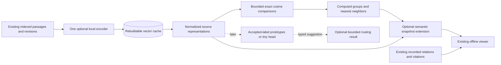

# Optional similarity perspective

Reviewed on 2026-10-04.
Status: proposed; no models installed, runtime modified or semantic results generated.
This proposal follows the [store and local-model research](../research/tomeowl-store-and-local-ai-2026-10-04.md) and preserves the frozen [UI baseline](../UI-BASELINE.md).
The request is to expose different interpretations of the same sources, beginning with vector similarity and computed group colors.

## Recommendation

Start with one optional embedding encoder, a rebuildable cache and a `Recorded / Similarity` perspective selector.
Use the encoder for source similarity, computed groups and, later, bounded category/routing suggestions.
The first graph slice needs no second decision model, ANN service, new renderer, browser inference or dimensionality-reduction library.
Keep the current node positions, graph forms, camera, motion and source identity while changing the interpretation of colors and selection emphasis.
A later semantic layout can place computed groups together, after the underlying matches prove useful.

The recommended first English model profile is `sentence-transformers/all-MiniLM-L6-v2`.
Use EmbeddingGemma 300M as the multilingual/shared-task comparison if English/Malay or other mixed-language documents are important.
These are proposed profiles, not installed dependencies or demonstrated Tomeowl quality results.

## What each perspective means

| Perspective | Color and organization | Selection meaning |
|---|---|---|
| Recorded, current default | Existing source-role/project colors and geometry. | Emphasis follows recorded undirected link hops; inspector opens quoted relationships. |
| Similarity, first addition | Computed-group fill or halo, with role shapes/outlines and organizational frames retained. | Emphasis follows direct selected-source cosine similarity; inspector lists inferred text matches. |
| Semantic layout, later | Computed groups occupy separate clouds; existing forms remain available. | Comparisons still use original vectors; screen distance does not establish a relationship. |
| Curated facets, later | Predefined labels from accepted examples, or a reviewed classifier. | Categories are routing/tagging proposals with Other/Uncertain outcomes. |

The current geometry is organized by role or project, so phase-one positions must continue to be described that way even when source colors change.
Similarity means content resemblance, not agreement, citation, dependency, causation or assertion truth.
Two sources can share a computed group while having weak direct similarity, particularly when a bridge document connects them.
Direct comparisons must therefore work across group boundaries and cannot use transitive graph hops.

## Small-model decision

| Candidate | Verified properties | Proposed use |
|---|---|---|
| [MiniLM-L6-v2](https://huggingface.co/sentence-transformers/all-MiniLM-L6-v2) | Approximately 22.7M parameters, English, 384 dimensions, default 256-wordpiece input; masked mean pooling and normalization; Apache-2.0. | First small English similarity profile, also usable with accepted-label prototypes. |
| [EmbeddingGemma](https://ai.google.dev/gemma/docs/embeddinggemma/model_card) | Approximately 300M, more than 100 languages, 2K context and 768 dimensions with smaller normalized options; task-specific clustering, classification and retrieval prompts; Gemma terms. | Multilingual comparison and explicit multi-task embedding profile. |
| [Qwen3-Embedding-0.6B](https://huggingface.co/Qwen/Qwen3-Embedding-0.6B-GGUF) | Larger multilingual/code profile; official GGUF, instruction handling and last-token pooling; Apache-2.0. | Longer-context comparison if the compact profiles miss meaningful evidence. |
| [Potion-base-8M](https://huggingface.co/minishlab/potion-base-8M) | Approximately 7.56M static token embedding parameters, English, 256 dimensions, MIT. | Optional ultra-small ablation; static averaging has limited contextual distinctions. |

MiniLM's official [ONNX artifacts](https://huggingface.co/sentence-transformers/all-MiniLM-L6-v2/tree/main/onnx) include an approximately 23 MB AVX2 uint8 model and a 90.4 MB float model.
Those are weight-file sizes, not total deployment size, peak RAM or supported-device guarantees.
Choose a tested artifact for the actual CPU; retain tokenizer, pooling and normalization behavior rather than treating raw token outputs as source vectors.
Existing indexed chunks are not model-token-bounded, so MiniLM needs explicit tokenizer-aware passage subdivision and recorded coverage instead of silent 256-wordpiece truncation.

[ONNX Runtime](https://onnxruntime.ai/docs/get-started/with-javascript/node.html) documents Windows CPU bindings, but tokenizer/native assets and compiled Bun compatibility still require a target-machine proof.
Keep the first inference adapter in an explicitly invoked, per-project batch process until that packaging question is resolved.
The packaged runtime, tokenizer and model together determine whether this is the smallest deployment.
EmbeddingGemma and Qwen may instead use a pinned [llama.cpp embedding executable](https://github.com/ggml-org/llama.cpp/blob/master/examples/embedding/README.md), with checkpoint-specific pooling/projection parity checks.
Exact code, model and tokenizer revisions and licenses must be recorded when selecting an implementation; this proposal does not authorize an unpinned latest-model download.

## One model can perform several bounded jobs

The initial encoder supplies vectors for neighbors and grouping.
For simple categories, embed accepted examples, average their normalized vectors into normalized category prototypes, and compare a new text to each prototype.
Return the best category only when its score and lead over the runner-up pass thresholds measured on held-out examples; otherwise return Uncertain.
Version the accepted-example set, label order and thresholds independently of the encoder contract.
This can suggest a topic or retrieval route, using the same weights and runtime.
Similarity scores and margins must remain scores rather than fabricated decision probabilities.

A small trained linear head can later map those frozen vectors to a fixed label set without adding a second encoder.
That is an additional trained artifact requiring independent labels, validation and calibration, even if inference is only a matrix multiplication.
[SetFit's documentation](https://huggingface.co/docs/setfit/conceptual_guides/setfit) explains why semantic similarity and useful classification are different objectives.
Full encoder fine-tuning changes the representation and requires a new model contract, cache rebuild and graph/retrieval evaluation.
EmbeddingGemma's task-specific prompts also create distinct representation profiles: sharing weights does not permit mixing clustering, retrieval and classification vectors indiscriminately.

Arbitrary evidence-dependent questions, contradiction detection, ordinal judgments or calibrated abstention are stronger requirements than category proximity.
Evaluate a dedicated Laya/Verdict-style decision encoder only if those tasks are needed and a shared-encoder approach demonstrably fails.
Keep classification outside the first graph interaction slice and keep every memory admission explicit.
It must not relabel existing source roles or silently rename computed groups as confirmed categories.

## Minimal data path



Read already indexed chunk bodies under explicit collection/source and byte bounds.
Subdivide long chunks into model-sized passages without changing the canonical chunks or inventing citation locators.
Cache each passage vector using source revision, canonical chunk ID, passage ordinal/span or content hash, and the complete embedding contract: checkpoint/tokenizer/runtime hash, segmentation, preprocessing, task prompt, pooling, normalization, output dimension and quantization.
Normalize passage vectors, average them into a normalized source centroid under a versioned aggregation recipe, and record eligible/embedded passages plus fully and partially represented chunks.
Use an explicit unknown total when a bound prevents discovering every eligible passage; do not report embedded passage count as the full source coverage.
Reject zero or non-finite vectors; they represent unavailable analysis rather than meaningful low similarity.
Mixed-topic centroids are coarse, so retain passage vectors for later passage-level comparisons and explain the representation in the inspector.

Exclude unfetched URL-only citation records from content analysis.
Generated project inventory boilerplate must not be interpreted as the project's actual semantic content.
An eventual project-level representation should aggregate eligible child documents with selected-file coverage; the initial Atlas project overview stays categorical.
This continues the current [snapshot and provenance contracts](../ARCHITECTURE.md).

Set an explicit initial analysis bound, for example 400 eligible sources, independently of the renderer's 400-source reference-form and 120-source Atlas caps.
Proposed starting work limits are 8 MiB of indexed input text, 4,096 embedded passages and 64 passages per source, with a bounded provider batch and process deadline; these are experiment settings rather than measured performance targets.
Record the numeric limits and omissions in the run, because a source count alone does not bound tokenization or encoder work.
Select that analysis input deterministically from explicit scope and disclose every omission; do not silently analyze whatever happens to be drawn.
At 400 sources, exact cosine needs 79,800 unique pair comparisons, so an ANN index or vector database is unnecessary for this first bounded experiment.
The 384-dimensional source vectors occupy 614,400 bytes as float32 before metadata and serialization.
Exported JSON is larger and must be measured against the current 16 MiB snapshot input ceiling.

Thresholded mutual-nearest-neighbor components are a small first grouping experiment, with sorted IDs/ties and recorded neighbor count and threshold.
Use manually reviewed positive and negative pairs to choose those parameters; no arbitrary cosine threshold is a confidence guarantee.
Its known tradeoffs are bridge-document chaining, fragmentation and ungrouped sources.
If these produce poor groups, compare a bounded deterministic spherical k-means implementation before adopting a clustering dependency.
Group assignments and color IDs are stable within a recorded analysis run and must not change when the user searches or filters layers.
Regeneration can change groups; preserve the old run identity and disclose the new run rather than promising timeless topic identities.

## Snapshot and implementation seam

Keep inferred measurements outside the canonical `relations` table and its evidence-backed snapshot array.
The current relation basis is structural/lexical/imported, and [makeSnapshot](../../src/store.ts) drops edges without valid current citations.
Adding an empty-evidence semantic relation would either disappear or weaken that contract.
Use one independently versioned optional `semantic` extension over existing source IDs/revisions.

A compact proposed contract is:

```ts
semantic?: {
  version: 1;
  runId: string;
  inputDigest: string;
  modelContract: string;
  dimensions: number;
  metric: "cosine";
  aggregation: string;
  grouping: { method: string; neighbors: number; threshold: number };
  limits: { maxSources: number; maxInputBytes: number; maxPassages: number; maxPassagesPerSource: number };
  coverage: { eligibleSources: number; analyzedSources: number; omissions: string[] };
  unavailable: Array<{ sourceId: string; revision: string; reason: string }>;
  sources: Array<{
    sourceId: string;
    revision: string;
    groupId: string | null;
    vector: number[];
    eligibleChunks: number | null;
    fullyEmbeddedChunks: number;
    partiallyEmbeddedChunks: number;
    eligiblePassages: number | null;
    embeddedPassages: number;
  }>;
  neighbors: Array<{ source: string; target: string; score: number }>;
};
```

This is a proposed interface, not an implemented schema.
The cache retains the complete model contract; the export also carries a small human-readable model/representation summary for the offline inspector.
Keeping bounded source vectors in the export allows direct cosine against every analyzed source on selection, without an exported pair matrix or browser model.
Top-k neighbors alone are insufficient for continuous dimming: an absent edge means it was not exported, not that the pair is dissimilar.
Compute comparisons on selection changes, not during every animation frame.

Validation checks source IDs, matching revisions, one compatible model contract, vector dimensions/norms, finite scores, grouping references and serialized bounds.
An old snapshot without this extension retains the current viewer.
A changed or missing included source revision makes its vector unavailable and invalidates the complete grouping run until regeneration, since removing a bridge source can change surviving groups.
Unchanged compatible source vectors can still support direct comparisons, but stale groups must be suppressed or explicitly marked historical.
These checks compare analysis with the static snapshot; they do not claim to detect file changes after export.

| Existing seam | Minimal proposed change |
|---|---|
| [Projection](../../src/viewer/projection.ts) | Filter semantic assignments and comparisons through the same source scope as the current map/list. |
| [State](../../src/viewer/state.ts) | Add one validated perspective preference, default Recorded. |
| [Graph focus](../../src/viewer/graph.ts) | Choose recorded BFS or direct cosine focus; retain camera and motion lifecycle. |
| [Reference scene](../../src/viewer/reference-scene.ts) | Preserve role glyphs, outlines and guides while selecting computed-group fill and source emphasis. |
| [Inspector](../../src/viewer/render.ts) | Add a separate Text similarity list and analysis coverage; retain cited connections. |
| [Snapshot export](../../scripts/export-snapshot.ts) | Validate the optional extension and full output size. |

## Interaction contract

Add one visible native selector, `Relationships: Recorded / Similarity`, beside the existing form controls.
Switching preserves source selection, scope, search, form, camera and motion, while clearing a recorded relation selection when entering Similarity.
Selecting a recorded edge returns to Recorded; do not arbitrarily choose one of its endpoints as a semantic root.
Use computed-group fill and an optional halo while retaining original role symbols/outlines, role-frame colors, selection outline and labels.
Add textual group identifiers and a legend; color and glow cannot be the sole identification path, including High contrast and Glow off.
If there are more groups than distinct palette colors, retain identifiers and disclose the grouping rather than treating repeated colors as identical categories.

Only draw selected-source similarity links initially.
Limit the first display to five selected-source links and five ranked inspector matches, with deterministic ties, independently of grouping neighbor count.
Direct cosine emphasis can still cover every analyzed source in scope, and the list discloses additional omitted matches.
Use a distinct dash pattern plus explicit text identification, because inventory edges and Atlas hulls already use dashes.
Show cosine values as similarity scores, never percentages of truth or confidence.
The inspector's Text similarity list is keyboard accessible and states model, source representation, score and available coverage; recorded connections remain separate.
Canonical relationship and citation counts must not include inferred comparisons.

Selecting an analyzed source computes direct comparisons across analyzed sources in scope, including matches outside its computed group.
Unknown, stale, excluded or missing vectors stay visibly neutral with a reason; do not reuse recorded-disconnected opacity for them.
An analyzed source with a valid vector and `groupId: null` is Analyzed, ungrouped, and remains eligible for comparison and emphasis.
With no usable selected vector, keep the map readable and explain that comparison is unavailable.
Show all nodes clears selection emphasis while preserving the chosen perspective.
Atlas's aggregate project overview keeps project colors and offers Open a project to compare sources.
Scope coverage remains distinct from renderer coverage, and hiding a source cannot change the meaning of an absent similarity measurement.

## Smallest proof before adoption

1. Build a batch-only encoder prototype with pinned local weights, tokenizer and CPU runtime; prove reference embedding parity, offline loading and Windows exit/error behavior.
2. Review matches from real research notes and selected project documents, including paraphrases, boilerplate, unrelated shared words and mixed-topic documents.
3. Check deterministic groups/ties under reordered input, valid direct cosine, unavailable/zero vectors, revision/model mismatches and stable colors through filtering.
4. Export one bounded optional artifact and add the perspective while preserving legacy snapshots, recorded relations, citations, selection, contrast/reduced motion and full accessible lists.
5. Evaluate label-prototype routing separately before exposing it as another product interaction.

Measure first-load/index time, warm selection latency, peak memory, full packaged size and serialized snapshot size on the target machine.
Review source-level matches separately from the existing chunk-level RAG evaluation; aggregation can conceal a relevant minority passage.
No embedding, grouping or classification quality has been measured in this review.
The [local retrieval research](../research/local-retrieval-stack-2026-10-04.md) and [Jev audit](../research/jev-local-2026-10-04.md) provide broader comparisons.
