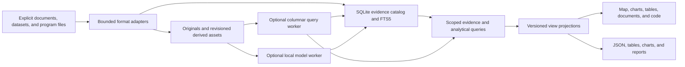

# Engineering evidence platform research

**Date:** 2026-10-03.
**Status:** public product research and architecture recommendations; no new runtime capabilities delivered.
**Companion:** [Engineering evidence specification](../drafts/ENGINEERING-EVIDENCE-SPEC.md).

## Recommendation

Develop Tomeowl as a portable engineering evidence workbench with a common evidence core and optional domain capabilities.
Documents, measurement datasets, and program structure should share identities, revision lineage, scope, and evidence links while retaining distinct storage and analysis methods.
The frontend should coordinate graph, plot, table, document, and code views through a shared selection contract.
This creates a broad product without requiring every task to become a graph or every input to become a text embedding.

Keep the current Bun/SQLite foundation and deliver the grouped, layered viewer from [M1](../drafts/MODERNIZATION-SPEC.md) first.
Then prove one literature workflow, one transformed measurement workflow, and one read-only program workflow as separate vertical slices.
Add STDF, local models, a larger graph renderer, or a graph engine only when a slice has an explicit correctness or performance need.

## Evidence and limits

This report combines local code inspection with current official project documentation, repositories, and license files.
Upstream functionality is distinguished from proposed Tomeowl behavior.
Library claims, screenshots, and examples do not establish performance, correctness, or packaging compatibility in Tomeowl.
No candidate library, model, parser, graph database, or BI adapter was installed or benchmarked in this pass.
The findings identify useful modern approaches rather than claim a universal SOTA winner.

The current implementation provides revisioned document/transcript ingestion, SQLite FTS5 retrieval, a bounded SVG source map, standalone HTML export, qmd corpus projection, and read-only Graphify validation.
Its source identity depends on normalized absolute paths, locators cover lines/timestamps, and spatial rendering is bounded to 1000 sources.
It does not yet provide portable source identity, PDF/OCR parsing, measurement analytics, STDF ingestion, program analysis, vector retrieval, or coordinated analytical views.
See [current architecture](../ARCHITECTURE.md), [baseline specification](../SPEC.md), and [verification history](../STATUS.md).

## Public use cases

| Capability | User question | Useful workflow | Boundary |
|---|---|---|---|
| Literature and technical research | Which sources support this method, requirement, or claim? | Search, screen, annotate, compare methods, inspect cited passages, export a source matrix | Metadata and model summaries are not evidence of a paper's findings |
| Semiconductor test analytics | Which test, site, attempt, setup, or population explains this result? | Filter lots/units, compare distributions and trends, trace results to limits and program revisions | Offline review first; suggestions do not automatically change production dispositions |
| Test-program analytics | Where is this test defined, what changed, and which results are affected? | Inspect source/configuration, compare revisions, link reviewed definitions to measured results | Read-only analysis; syntax extraction is not proof of runtime behavior |
| Engineering documents | How do a requirement, datasheet table, drawing, and verification record connect? | Inspect native locators, track reviewed links, compare revisions, assemble evidence | A picture of a schematic does not establish an electrical netlist |
| Project and AI session knowledge | Why was this decision made, and which implementation supports it? | Cited session/repository search, dependency neighborhoods, decision and change evidence | No implicit scanning or writeback across projects |
| Experiment review | Which preprocessing, model, split, and data revision produced this chart? | Compare experiment manifests, metrics, errors, and source cohorts | Reproducible analysis records; model training remains an optional external job |
| Management and downstream reporting | What changed, what is covered, and what needs investigation? | Curated views, traceable counts, annotated charts, neutral data exports | Summary scope and definitions remain visible; decorative panels never invent operational data |

These are reusable public engineering workflows.
Workspace content, personal notes, organization identifiers, credentials, and unpublished data belong in separately configured local workspaces rather than the software distribution.

## Core architecture

### Store each representation for its actual job

| Representation | Proposed default | Reason | Upgrade trigger |
|---|---|---|---|
| Source metadata, evidence links, annotations, jobs, memberships | Existing SQLite catalog, incrementally migrated | One small transactional core and rebuildable indexes | Measured concurrent/shared deployment need |
| Document chunks and exact identifiers | Existing FTS5 with evaluated aliases/tokenization | Keeps a useful offline baseline | Fixed-query evaluation shows missing semantic recall |
| Small text vector collections | Optional bounded exact scan over versioned vectors | Avoid native indexing machinery before it is needed | Measured latency/memory failure at the declared corpus |
| Larger vector collections | sqlite-vec or LanceDB spike | Specialized retrieval through a stable query seam | Packaging, scope, recall, and resource gates pass |
| Numeric observations | Versioned Parquet assets and optional DuckDB worker | Preserve typed columns and query selected aggregates | A supported dataset outgrows the baseline query plan |
| Program syntax and definitions | Original source plus derived span/definition records | Keep source authority and revision comparison | A concrete semantic analysis requires another reviewed tool |
| Graph relationships | Typed SQLite edge/membership records and bounded traversal | A visible graph does not require a graph database | Named multihop queries justify an embedded graph engine |
| UI layouts and saved views | Versioned preference records outside evidence facts | Presentation changes remain cheap | Multiple view consumers require synchronization |

FTS5 is SQLite's dedicated full-text module, with tokenization and ranking/query facilities that can support a transparent lexical baseline. [SQLite FTS5](https://sqlite.org/fts5.html)
Arrow defines a columnar memory and interchange representation; it is a useful boundary for bounded batches rather than a second authoritative evidence database. [Arrow columnar format](https://arrow.apache.org/docs/format/Columnar.html)
The choice of Parquet assets, query recipes, and storage partitions here is a Tomeowl proposal, not a measured requirement of the existing corpus.

### Engine and retrieval candidates

| Candidate | Verified upstream capability | Proposed use in Tomeowl | Decision |
|---|---|---|---|
| DuckDB Node Neo | Native bindings with Windows x64 support | Local numerical query spike | Optional; Node support does not prove Bun executable compatibility |
| DuckDB-Wasm | Browser analytics and Arrow result batches | Browser-only measurement demonstration | Optional capability profile; package assets locally and test browser restrictions |
| sqlite-vec | C vector extension, Windows/Wasm targets, metadata filtering; pre-v1 | Small local vector index spike | Keep optional and pin exact artifacts after evaluation |
| LanceDB OSS | Embedded multimodal/vector retrieval with language SDKs | Larger retrieval workload | Consider only after exact-scan/index comparison |
| LadybugDB | Embedded property graph, Cypher and language bindings | A named traversal workload | Benchmark later; validate native packaging and migration |
| Kuzu | Archived upstream repository | Historical reference | Avoid as a new core dependency |
| Graphify | Existing provenance-validation adapter | Candidate relationship extraction | Retain read-only validation until explicit promotion is designed |

DuckDB's current Node client uses native binding packages; the required compatibility spike must run both development and the compiled Windows executable with the same dataset. [Node Neo overview](https://duckdb.org/docs/lts/clients/node_neo/overview)
DuckDB-Wasm supports materialized queries and streaming Arrow batches, so interactive queries should return bounded aggregates or batches rather than materialize every row. [Wasm query API](https://duckdb.org/docs/current/clients/wasm/query)
Its deployment and worker assets require explicit packaging; multithreaded execution also introduces browser isolation requirements. [Wasm deployment](https://duckdb.org/docs/lts/clients/wasm/deploying_duckdb_wasm), [Wasm instantiation](https://duckdb.org/docs/current/clients/wasm/instantiation)

sqlite-vec explicitly warns that its pre-v1 interface may change, which strengthens the case for a narrow optional adapter and portable vector metadata. [sqlite-vec repository](https://github.com/asg017/sqlite-vec)
LanceDB's OSS embedded library is separate from its managed offerings; a local adapter should not silently enable cloud storage or automatic model downloads. [LanceDB repository](https://github.com/lancedb/lancedb)
The Kuzu repository was archived on 2025-10-10, while Ladybug documents its embedded graph interfaces and Kuzu lineage. [Kuzu repository](https://github.com/kuzudb/kuzu), [Ladybug repository](https://github.com/ladybugdb/ladybug)

Do not install all of these engines together.
The preferred initial design uses the existing evidence database and at most one optional numerical worker.
If native bindings complicate the executable, compare a bundled helper process against the browser Wasm route before choosing a runtime.
A helper must still satisfy offline, user-space, bounded-resource, cancellation, and clean-machine requirements.

### Identity, locators, and lineage

A source should receive a workspace-stable identity independent of its current absolute path.
File aliases and revision hashes should record relocation and changes without merging distinct files that happen to have identical bytes.
An evidence reference should name source, revision, extraction run, and a typed locator.
Useful locator types include text lines, transcript intervals, PDF page/bounding box, spreadsheet sheet/cells, dataset record/row selector, and code byte/syntax spans.
Do not imply these locators already exist in schema v1.

Extraction identity must include parser name/version/configuration, input revision, and output schema.
Analysis identity must additionally include query/preprocessing/model settings, supported input scope, and result hashes.
The same bytes parsed under a new configuration can produce different evidence.
An edited source should invalidate affected derived results while preserving the last good revision for inspection.
Migration must retain the current locator contract until new consumers support the richer schema.

### Jobs, scope, and recovery

Expensive parsing, layout, analytical queries, and inference should run outside the UI thread or synchronous CLI orchestration path.
Use bounded jobs with explicit queued, running, succeeded, partial, failed, and cancelled states.
Write into staging assets, validate results, then activate the new revision atomically in the catalog.
A cancelled or failed job must not replace the last complete result with a half-built view.
Cross-store activation requires an asset hash manifest because SQLite transactions do not encompass external Parquet files.

Apply scope before ranking, traversal, aggregation, grouping, and export.
An exported public subset must not retain groups, top-k neighbors, labels, counts, or coordinates derived from excluded material unless that derivation is explicitly permitted.
Filtering raw records after a global computation is insufficient for that boundary.
Local workspace separation is a useful deployment boundary; a future shared server additionally needs enforceable authorization rather than trusting viewer filters.

DuckDB's official security guidance treats untrusted SQL as executable code and says configuration hardening is not a replacement for sandboxing. [Securing DuckDB](https://duckdb.org/docs/current/operations_manual/securing_duckdb/overview)
Expose approved analytical recipes with validated dataset/column identifiers and parameterized values as the baseline.
Disable automatic extension installation, network access, and unrestricted paths in the selected execution profile.
Do not give a model-generated query the native process's unrestricted filesystem privileges.

## Literature and multi-format evidence

### Discovery and screening

| Integration | Fit | Boundary |
|---|---|---|
| Crossref | DOI identity and deposited bibliographic metadata | Metadata completeness varies; abstract rights and full-text rights remain separate |
| OpenAlex | Broader scholarly discovery and metadata relationships | API quotas/authentication are configurable; offline use begins with permitted cached exports |
| Zotero files | User-selected bibliographic export import | File import first; preserve item keys and originating library identity |
| Zotero local API | Optional offline read adapter | Explicitly configured collection; no implicit whole-library ingestion or writes |

Crossref's REST API exposes deposited metadata, and its documentation distinguishes broadly reusable metadata from potentially copyrighted abstracts. [Crossref REST documentation](https://www.crossref.org/documentation/retrieve-metadata/rest-api/)
OpenAlex currently allows casual access without a key, offers a higher free allowance with a key, and provides CC0 metadata/snapshots; this does not license every linked full-text document. [OpenAlex authentication](https://help.openalex.org/api/authentication/), [OpenAlex access and pricing](https://help.openalex.org/access/pricing/), [OpenAlex snapshot access](https://help.openalex.org/access/sync/)
Zotero exposes an opt-in local API for offline access; current versions distinguish read requests from separately authorized write support. [Zotero local API](https://www.zotero.org/support/dev/web_api/v3/local_api)

The proposed workflow is query manifest -> cached metadata -> deduplicated candidates -> human screening -> permitted full text -> passage annotations -> comparison matrix -> cited output.
Record provider, query, filters, timestamp, response identity, duplicate decisions, and inclusion/exclusion reasons.
Preserve preprint/journal versions and corrections instead of automatically treating every similar title as one paper.
A claim ledger should distinguish a direct source passage, an analyst interpretation, and a model suggestion.
Generated research gaps require review against actual studies; absence from one retrieval result is not evidence that no prior work exists.

### Parsing choices

| Tool | Upstream fit | Proposed role | Cost/quality boundary |
|---|---|---|---|
| MarkItDown | Many office/document/media formats into Markdown | Lightweight format adapter candidate | Flat Markdown can lose layout, table semantics, and native locators |
| Docling | Structured document representation with layout/table support | Optional high-fidelity document worker | Model assets and larger runtime need explicit packaging and licensing checks |
| GROBID | Scientific document structure and bibliography extraction | Specialized optional batch helper | Official deployment guidance includes substantial memory/runtime needs |
| Domain-specific readers | Typed spreadsheets, STDF, source code, or netlists | Preserve native semantics | Do not funnel authoritative numerical/electrical structure through prose conversion |

MarkItDown's official repository documents format-specific optional dependencies and plugin behavior; its Markdown conversion is useful for search but should not replace a rich original preview or typed measurement parser. [MarkItDown](https://github.com/microsoft/markitdown)
Docling's structured representation is useful when layout and tables matter, and the project distinguishes its MIT code license from individual model licenses. [Docling](https://github.com/docling-project/docling)
GROBID's deployment documentation makes its batch/service resource needs visible, supporting an optional specialist role rather than a mandatory portable baseline. [GROBID documentation](https://grobid.readthedocs.io/en/latest/), [GROBID deployment](https://github.com/grobidOrg/grobid/blob/master/doc/Grobid-docker.md)

Multi-format ingestion means several reviewed adapters and linked evidence objects.
It does not mean every PDF, photo, schematic, spreadsheet, and STDF record can be interpreted correctly by one generic multimodal model.
OCR text, extracted tables, and image descriptions must expose uncertainty and the original region.
An image embedding can aid discovery while an electrical connection still requires a validated netlist or reviewed annotation.

## Semiconductor measurement analytics

Start with explicitly exported CSV/Parquet measurements and a documented mapping profile before implementing raw STDF.
Exports from yield tools should be treated as selected files with declared schemas, units, identifiers, and transformations, without assuming access to proprietary databases or undocumented vendor APIs.
Each exporter/profile needs fixture coverage for nulls, invalid results, limits, flags, and provenance loss.

### Proposed data model

| Object | Minimum meaning |
|---|---|
| Dataset revision | Input/export hashes, schema, mapping profile, source coverage, parser run |
| Test definition | Program revision, test identifier/name, condition, units, limits, matching status |
| Observed unit | Dataset-local identity and available trace keys; cross-file identity can be unresolved |
| Test attempt | Sequence, available head/site/time/setup context, retest state, and join confidence |
| Measurement | Typed value, validity and result flags, definition reference, attempt reference, native locator |
| Cohort | Revision-pinned predicate, denominator, exclusions, and missingness rules |
| Analysis run | Query/transform settings, input scope, output asset/hash, status, and warnings |

Do not collapse retests, missing measurements, invalid measurements, and valid failures into one number.
Do not assume a unit ID is globally unique or that a test number keeps the same meaning after a program revision.
Explicit reconciliation tables should record unresolved trace joins and reviewed aliases.
Test-order-dependent and multisite records require validated attempt reconstruction before unit comparisons.
Limits, units, decimal scaling, and test conditions must survive transformations.
Declare precision and interchange rules for large identifiers, scaled decimals, nonfinite values, timestamps, and nulls so JSON/browser conversion cannot silently change their meaning.
Retain the original value/encoding where conversion is lossy, and distinguish numerical display rounding from the values used in filters and comparisons.

For raw STDF, rust-stdf is a Rust candidate with documented record types and optional compression/serialization features; Semi-ATE STDF provides a Python reference implementation. [rust-stdf repository](https://github.com/noonchen/rust-stdf), [rust-stdf API](https://docs.rs/rust-stdf/latest/rust_stdf/), [Semi-ATE STDF](https://github.com/Semi-ATE/STDF)
Treat parser support as an input to evaluation, not proof that every file variant and unit/head/site/attempt association is correct.
Use independent decoding and expected-count fixtures for supported record families, malformed/truncated files, compression, byte order, and concurrent sites.
Preserve unsupported records as warnings or retained raw slices where feasible; never silently classify an incomplete dataset as complete.
Pin the supported dialect and record semantics against the relevant format documentation before accepting a parser into a release.

### Analytical and vector uses

| Task | Prefer first | Optional learned representation | Required interpretation |
|---|---|---|---|
| Histogram, trend, site comparison | Typed filters and explicit aggregates | None needed | Population, units, limits, attempt policy, and denominator |
| Similar units/lots | Reviewed features and distance baseline | Numerical/tabular encoder | Training scope, normalization, missingness, setup/program revision |
| Similar papers/program notes | FTS and identifier search | Text encoder | Passage citations and explicit similarity reference |
| Review prioritization | Rules/statistical baseline | Calibrated anomaly or classification model | Abstention, error costs, drift, reviewed outcomes |
| Setup/history relationships | Typed provenance and reviewed joins | Candidate graph links | Direction, time, matching uncertainty, supporting evidence |
| Wafer patterns | Coordinates and population comparison | Spatial model | Valid coordinate system and acquisition context |

Text embeddings of serialized numeric rows are not the default for quantitative analytics.
Build numerical features with explicit scaling, units, invalid/missing masks, and revision-aware populations.
Keep discovered similarity separate from physical causality, tested electrical dependency, or confirmed root cause.
For classification experiments, separate training and evaluation by the relevant time/lot/product/program boundaries and prevent post-result labels from entering the features.
The workbench should store and compare evaluation manifests without promising automated lot/unit rejection or in-tester deployment.

## Read-only test-program and engineering source analytics

Tree-sitter provides incremental concrete syntax trees with error-tolerant parsing and query support. [Tree-sitter](https://github.com/tree-sitter/tree-sitter), [query syntax](https://tree-sitter.github.io/tree-sitter/using-parsers/queries/1-syntax.html)
It is a useful optional adapter for Java and C++ spans, definitions, and syntactic references.
A syntax tree does not resolve Java dispatch/reflection, C++ macro/build variants, proprietary APIs, or runtime test-flow decisions.
Grammar revisions, preprocessing assumptions, and parse errors must be recorded.

For V93000-oriented Java and optional T2000-oriented C++ review, begin with permitted source/configuration exports and a synthetic fixture independent of tester SDKs.
Support definition search, revision diffs, changed limits/parameters, declared flow steps, and inspected references.
Separate syntactic references, reviewed definition matches, and inferred relationships in the atlas.
Joining measured tests to program definitions needs a versioned mapping of test IDs, names, units, conditions, limits, and effective revisions.
Ambiguous matches remain unresolved candidates; matching a numeric ID alone is insufficient.

Later netlist, schematic, requirements, and verification adapters can reuse the same evidence contract.
They should provide domain-specific links and locators without turning the generic core into a tester SDK or electronic design tool.
The baseline never executes a test program, modifies limits, or loads customer code to discover its behavior.

## Hyperinteractive frontend

### Interaction direction

The strongest direction is a coordinated engineering workbench with an authored command-center identity.
Keep charcoal and warm orange chrome, readable typography, category colors, and restrained luminous emphasis from [the existing design brief](../../DESIGN.md).
Give the visual space meaningful hierarchy: group overview -> focused neighborhood -> evidence detail.
Use group boundaries, labels, scale, shape, and selective edges to expose structure before adding ambient effects.

Four proposed surfaces share one scope and selection model:

| Surface | Dominant task | Main view | Linked evidence |
|---|---|---|---|
| Evidence Map | Discover topics and relationships | Grouped map and source list | Passage, relation provenance, comparison |
| Measure Lab | Explain population behavior | Histograms, trends, matrices, tables, optional wafer map | Selected cohort, unit history, limits, definitions |
| Program Atlas | Inspect definitions and changes | Flow/dependency neighborhood and revision diff | Code/config spans, mapped tests, measured populations |
| Review Desk | Assemble a decision or presentation | Pinned evidence, comparison matrix, annotated charts | Reproducible findings and exported projections |

For example, brushing a histogram tail should filter a unit table, compare sites/attempts, and expose the reviewed test definition plus its source span.
Selecting a definition should show related measurement populations and document evidence without disturbing the current analytical cohort.
A literature view should link a screened paper, its cited passage, a method matrix, and a reviewed engineering requirement.
These interactions require shared predicates and provenance, not just panels placed next to a graph.

### Framework and project references

| Candidate/reference | Upstream capability | Best fit | Tomeowl decision |
|---|---|---|---|
| Existing authored SVG/DOM | Current bounded map and native source targets | First grouped-map iteration and static export | Keep for M1 |
| Sigma + Graphology | WebGL graph rendering with separate label/overlay layers | Larger interactive evidence maps | Benchmark a stable version later; v4 is currently prerelease |
| Cytoscape.js | Graph visualization/interaction and analysis APIs | Flow/dependency atlas with graph-specific interactions | Alternative spike, not an additional default renderer |
| Apache ECharts | Canvas/SVG analytical chart rendering | Rich local analytical panels | Evaluate one histogram/trend/table interaction slice |
| Vega-Lite | Declarative point/interval selections and chart composition | Reproducible chart exports and BI-compatible projections | Prefer first portable chart artifact |
| Mosaic/vgplot | SQL-backed coordinated selections and aggregate queries | Reference for linked analytical views | Study/benchmark; avoid assuming a drop-in Bun integration |
| Perspective | Pivot, table, chart, and streaming analytical views | Advanced dataset inspection | Optional alternative if real pivot requirements justify it |
| Native browser transitions/workers | Progressive transitions and background processing | Current TypeScript viewer evolution | Feature-detect; preserve a still, useful fallback |

Sigma's layer documentation shows a WebGL/Canvas/DOM rendering split, while its v4 site currently identifies a beta release. [Sigma layers](https://www.sigmajs.org/docs/advanced/layers/), [Sigma v4](https://v4.sigmajs.org/)
Cytoscape is a distinct graph toolkit candidate rather than an automatic fallback for a Sigma implementation. [Cytoscape.js](https://github.com/cytoscape/cytoscape.js)
ECharts supports both Canvas and SVG; its guidance recommends choosing through workload/environment evaluation rather than treating a nominal element count as a Tomeowl capacity guarantee. [ECharts renderer guidance](https://echarts.apache.org/handbook/en/best-practices/canvas-vs-svg/)
Vega-Lite's parameter/selection model supports linked chart behavior, but linking arbitrary graph/code/document components still needs an application selection contract. [Vega-Lite parameters](https://vega.github.io/vega-lite/docs/parameter.html)

Mosaic separates coordination/querying from views, and vgplot demonstrates selections translated into database aggregates. [Mosaic](https://idl.uw.edu/mosaic/), [vgplot](https://idl.uw.edu/mosaic/vgplot/)
Its current repository recommends its Python server over the retained Node DuckDB server because of binding/Arrow maintenance concerns; this is a relevant integration caution for Tomeowl. [Mosaic repository](https://github.com/uwdata/mosaic)
Perspective's current repository and package names are under `perspective-dev` and `@perspective-dev`; do not copy older FINOS package assumptions into a new integration. [Perspective repository](https://github.com/perspective-dev/perspective), [Perspective documentation](https://perspective-dev.github.io/)

Use these projects as alternatives and references.
The product should own its selection/evidence contracts rather than adopt several overlapping query engines and chart frameworks.
A React rewrite, desktop shell, or 3D engine is not needed to establish the next experience.

### Purposeful special effects

Make the signature interaction a group opening in place, with unaffected groups receding, a stable selected source, and a short evidence trail revealing the linked chart or source region.
Keep layouts cached and camera context persistent; ordinary selection must not restart a force simulation.
At overview zoom, show representative labels and aggregate groups; reveal detail only as the user enters a neighborhood.
Keep categorical group color, status marks, and reference-based similarity heat as separate channels with explicit legends.
Missing scores remain visibly unscored, and similarity scores are not confidence probabilities.

Use motion to communicate expansion, selection, comparison, and processing completion.
Keep reading surfaces and pointer targets stable, suspend ambient animation while hidden, and provide reduced-motion/still modes and default-off sound.
Native View Transitions can be a progressive enhancement, while disabled/unsupported transitions retain the same state change. [View Transition API](https://developer.mozilla.org/en-US/docs/Web/API/View_Transition_API)
The W3C guidance on interaction-triggered animation supports user control over nonessential motion; Tomeowl can apply that policy to all modes. [W3C animation guidance](https://www.w3.org/WAI/WCAG22/Understanding/animation-from-interactions.html)

## Models and experimental extensibility

Add models as explicit jobs producing versioned vectors, classifications, or relationship candidates.
Start with existing lexical/rule/statistical baselines and a bounded evaluation corpus.
Text search embeddings, numerical anomaly features, image representations, and relationship extraction have different objectives and should not share an unexplained universal score.
Retain the model hash, license, preprocessing, runtime backend, inference settings, calibration, and input revisions.
Expose unknown/abstain and review states instead of silently promoting model output into a fact.

ONNX Runtime Web offers several browser execution backends whose operator/model coverage differs; it is a candidate runtime rather than a guarantee that any chosen model will work everywhere. [ONNX Runtime Web](https://onnxruntime.ai/docs/get-started/with-javascript/web.html)
A CPU/offline fallback and an absent-model path must remain useful.
The earlier [backend/model comparison](backend-options-2026-10-02.md) remains the reference for optional text encoders, OpenJev, and Gemma candidates.
Complex sequence, generative, or multimodal models belong in evaluated experiment packs; they do not need to enter the evidence-core dependency tree.

## Portability, licensing, and downstream dashboards

| Profile | Required behavior | Optional additions |
|---|---|---|
| Static review | Standalone HTML, locally included assets, bounded snapshot, accessible source list | Saved presentation state and precomputed charts |
| Local workbench | Foreground loopback process, explicit workspace, no mandatory network/admin install | Numerical/parser/model helpers and workers |
| Headless integration | CLI JSON, exit codes, stable schemas, bounded outputs | Batch queries and neutral exports |
| Future shared service | Same evidence contracts plus enforceable authentication/authorization | Organization deployment and collaboration |

A browser Wasm library does not automatically preserve the current one-file `file://` export.
Test module/worker loading, local assets, browser memory, isolation headers, extension loading, network blocking, and fallback behavior on the supported profile.
Keep static exports capable of showing precomputed results when live analytics cannot run.
Portable deployment should not assume Docker, WSL, globally installed Python/Java, or system-wide GPU tooling.

License suitability is an artifact inventory task: exact code version, transitive components, notices, grammars, fonts, model weights, and dataset/document rights.
For example, sqlite-vec includes an MIT license, LanceDB OSS uses Apache-2.0, and Mosaic uses BSD-3-Clause with separately noted Observable Plot portions. [sqlite-vec license](https://raw.githubusercontent.com/asg017/sqlite-vec/main/LICENSE-MIT), [LanceDB repository/license](https://github.com/lancedb/lancedb), [Mosaic license](https://raw.githubusercontent.com/uwdata/mosaic/main/LICENSE)
Docling's code license does not determine its models' terms, and bibliographic metadata terms do not determine full-text rights.
Reimplementing an interface or combining tools does not remove those obligations.
Choose Tomeowl's own public license explicitly before distribution; no license choice is made by this research pass.

Export neutral versioned JSON/JSONL and typed tables with manifests before adding dashboard-specific artifacts.
Use a pinned, locally bundled Vega-Lite chart specification for the first reusable visualization projection.
For Power BI, validate one table bundle and a report fixture, reconcile distinct counts, then maintain any PBIP project downstream.
Microsoft documents PBIP as text-based report/semantic-model project files, which supports template-based integration rather than making Tomeowl's core depend on a Power BI project structure. [Power BI projects](https://learn.microsoft.com/en-us/power-bi/developer/projects/projects-overview)
The earlier [UI/interoperability report](ui-interoperability-2026-10-02.md) covers Deneb and the limits of embedding a full interactive map in BI.

## Recommended implementation experiments

| Experiment | Smallest demonstration | Evidence to collect | Stop/upgrade rule |
|---|---|---|---|
| Grouped map | Existing fixture plus a declared 1k-source fixture | Task completion, hierarchy comprehension, selection/frame time, motion/accessibility | Retain existing renderer until a measured blocker |
| Literature review | Selected bibliography plus permitted full text | Deduplication, screening lineage, page/span correctness, cited export | Add specialist parsing only for observed errors |
| Measurement review | Synthetic transformed test data and one linked histogram/table | Null/flag/retest handling, reconciled counts, cohort reproducibility, query resources | Prove typed semantics before STDF |
| STDF adapter | Supported tiny record fixtures and independent decode | Counts, scale/flags, multisite/attempt joins, malformed-input behavior | Reject unsupported interpretation instead of guessing |
| Program atlas | Synthetic Java/configuration, then optional C++ | Span accuracy, changed definitions, unresolved matches, evidence linking | Add semantics only with an explicit analysis need |
| Renderer/engine spike | Same declared graph queries and view fixture | Startup, bundle size, memory, p95 interactions, offline packaging | Adopt only a demonstrated improvement |
| Model pack | Reviewed fixed train/evaluation scope | Baseline comparison, errors, abstention, drift, runtime/weights size | Keep optional if benefits are weak or deployment fails |
| BI export | One neutral data bundle and one chart/report template | Schema round-trip, count reconciliation, export scope and metadata inspection | Add templates only for a validated consumer |

Record Windows/browser/hardware, corpus and asset hashes, exact package versions, cold/warm runs, median/p95, and peak resources.
Proposed targets remain budgets until measured on a declared fixture.
Keep unrelated experiments out of each delivery slice.
The [companion specification](../drafts/ENGINEERING-EVIDENCE-SPEC.md) defines capability gates and acceptance behavior; the existing [M1 prompt](../drafts/MODERNIZATION-SPEC.md#codex-or-claude-implementation-workflow) remains the next coding request.
