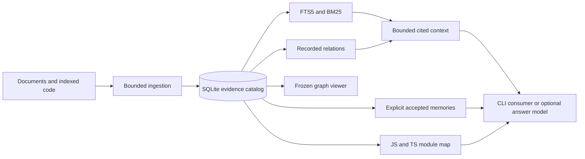

# Tomeowl's store and optional local intelligence

Checked on 2026-10-04.
The recent-discussion window is 2026-09-04 through 2026-10-04.
This is a researched recommendation, not a record of model installation or implemented semantic retrieval.
The current UI remains frozen as `ui-2026-10-04`.

## Decision

Keep SQLite as Tomeowl's authoritative evidence catalog and keep the existing CLI usable without models.
Improve the selection of supporting passages first, then evaluate optional local embeddings for vocabulary mismatch.
Treat a small reranker and a Jev-style decision controller as separate optional experiments.
An embedding finds similar content, a reranker compares a query with retrieved passages, and a decision controller chooses among explicitly defined alternatives.
None of these replaces accepted-memory lifecycle rules, source provenance or repository structure.

The recorded project evaluation retained 11 of 14 manually annotated anchors across 14 questions and a 123-chunk research corpus.
Two remaining misses concern supporting-chunk selection and one concerns different vocabulary.
All labeled sources already appeared within the first five lexical candidates; the partial labels do not establish general retrieval quality.
That evidence favors better packet selection before a mandatory inference dependency ([evaluation guide](../RETRIEVAL-EVALUATION.md), [paired verification](../../data/retrieval-evaluation-2026-10-04/verification.json)).
These new research notes change a future ingested corpus, so the earlier controlled comparison must retain its recorded corpus hash.

## How Tomeowl uses its store today

| Stored layer | Current use | Actual limitation |
|---|---|---|
| Sources and chunks | SQLite retains source metadata, content revisions, captured chunk bodies, order and line/time locators. | Reindexing replaces a source's ordinary chunks; this is not a complete document-revision archive. |
| `chunk_fts` | SQLite FTS5 indexes chunk text and BM25 ranks literal word/phrase matches within the requested scope. | No embeddings, vector index or semantic inference. |
| Relations | Recorded endpoints, relation kind, basis and quoted evidence support adjacency, graph expansion and visualization. | Graph distance is not semantic relevance or confidence. |
| Accepted memories | A separate table in the same catalog stores namespace, kind, author/origin, lifecycle, expiry, supersession and captured citations. | Recall currently uses a case-sensitive literal substring; admission and correction are explicit. |
| Repository map | Indexed JS/TS text is scanned for import paths and exported names using Bun. | No complete signature, type, reference or resolved call graph. |

This description follows the current [store](../../src/store.ts), [memory implementation](../../src/memory.ts), [context selection](../../src/context-query.ts), [repository map](../../src/repomap.ts) and [capability guide](../CAPABILITIES.md).
FTS5 BM25 and match highlighting are lexical search capabilities; they do not compute model vectors ([SQLite documentation](https://sqlite.org/fts5.html)).

Tomeowl currently supplies the retrieval portion of a RAG workflow; the consuming application supplies answer generation.
It validates captured source/revision/chunk references, literal quote membership and locator containment, rather than judging whether a generated answer is entailed or factually true.
An accepted memory can preserve its captured citation after the ordinary indexed source changes, but that does not make the assertion itself verified.
Memory namespaces select scope and are not an authorization system.

## What the current research supports

There is no verified universal October 2026 winner across memory, RAG, knowledgebases and repository maps.
Those tasks need different evidence and evaluation protocols, and the checked live MTEB page did not expose a readable current ranking.
The practical pattern supported by the reviewed implementations is lexical and semantic candidate retrieval, evidence-preserving graph expansion, bounded selection, explicit memory lifecycle and structure-aware code context.
Adopt a component only when it improves Tomeowl's own held-out cases within its Windows, latency, memory and packaging limits.

| Area | Useful reference | What to borrow |
|---|---|---|
| Hybrid RAG and knowledgebases | [Quanta paper, September 16](https://arxiv.org/abs/2609.18248) | Fuse dense and lexical rankings, then rescore graph-expanded content; the paper explicitly does not establish retrieval superiority. |
| Memory curation | [Grounding Agent Memory, September 10](https://arxiv.org/abs/2609.11060) | Use scoped read-only validation and freshness evidence before promoting proposed memories. |
| Typed decision control | [Jev launch, September 15](https://typesafe.ai/blog/introducing-system-one-models-and-jev) and [Jev-Mem, September 21](https://arxiv.org/abs/2609.23986) | Separate bounded decisions from memory storage and answer synthesis. |
| Durable agent recall | [Funes author's introduction](https://huggingface.co/blog/funes) | Preserve source traces, index incrementally, retrieve with lexical/semantic fusion and include neighboring context where useful. |
| Memory feedback | [Slowave implementation](https://github.com/slowave-ai/slowave) | Track reinforcement, weakening and lifecycle feedback separately from factual truth; storage does not independently judge assertions. |
| Temporal and entity memory | [Graphiti](https://github.com/getzep/graphiti), [Mem0](https://github.com/mem0ai/mem0), [Letta memory blocks](https://docs.letta.com/v1-sdk/memory/memory-blocks) | Distinguish episodes, assertions, validity and a small always-attached memory packet. |
| Repository context | [Aider repository map](https://aider.chat/docs/repomap.html) | Rank definitions, references and signatures under a context budget when the existing import/export inventory becomes insufficient. |

The October 3 public discussion surfaced [Repopedia](https://github.com/bolongpa/repopedia), checked at version 0.2.1: a Python/TypeScript Tree-sitter graph in one SQLite file, with BM25, CLI JSON and MCP access, deliberately requiring no embeddings for structural queries.
Its upstream documentation leaves ambiguous or unknown call targets unresolved, rather than presenting heuristic name matching as full type resolution ([agent documentation](https://github.com/bolongpa/repopedia/blob/main/SKILL.md)).
That is a useful next contract for Tomeowl: definition spans, typed structural edges and explicit resolution status.
Repopedia declares MIT, but its Windows execution and comparative accuracy were not verified here.

[Code Context Engine](https://github.com/elara-labs/code-context-engine), checked at 0.4.26, combines separate SQLite lexical/vector/graph stores and persistent memory with Fastembed ONNX or Ollama.
Its documented Windows installation requires C++ Build Tools and CMake, increasing deployment complexity over Tomeowl's compiled CLI.
The inspected ordinary [indexing path](https://github.com/elara-labs/code-context-engine/blob/main/src/context_engine/indexer/pipeline.py) emits imports and definitions; that observation does not establish a resolved cross-file call graph across every path.
Its advertised context reduction compares against whole-file reads, while its [benchmark implementation](https://github.com/elara-labs/code-context-engine/blob/main/benchmarks/run_benchmark.py) measures returned-file recall and warmed repeated queries.
These are useful component examples rather than proof of superior agent task performance or a reason to adopt the whole stack.

Funes was published on September 3, just outside this window, while its September 4 Hacker News discussion falls inside it.
Its default local design is distinct from optional Hub synchronization; adopting the design does not require Lance storage or account integration.
Slowave's repository is a useful implementation reference, not a verified performance baseline; its [license](https://github.com/slowave-ai/slowave/blob/main/LICENSE) declares AGPL-3.0-or-later, so it is not a permissively licensed drop-in dependency.
Graphiti and Mem0 are useful architectural comparisons, but their managed benchmarks and optional providers do not establish results for a minimal offline Tomeowl configuration.
The [stack research](local-retrieval-stack-2026-10-04.md) records additional embedding, runtime, licensing and evaluation details.

## Include something like Jev locally

Yes, as an optional bounded decision provider after retrieval improves and labeled decision cases exist.
Official Jev is a hosted System One model that returns constrained choices or scores; the reviewed official documentation does not provide downloadable weights ([official introduction](https://typesafe.ai/blog/introducing-system-one-models-and-jev), [API](https://api.typesafe.ai/redoc)).
Independent projects called OpenJev do not share one model, hardware requirement or calibration guarantee.

| Candidate | Appropriate experiment | Constraint |
|---|---|---|
| [Laya](https://github.com/NandhaKishorM/laya) | Local typed routing, candidate choice or memory-type proposals. | CPU/ONNX paths exist, but base probabilities are overconfident and its specialized checkpoints are not trained on Tomeowl's domain. |
| [Verdict](https://github.com/Heman10x-NGU/Verdict-open-jev) | Smaller 151M decision encoder, including insufficient evidence. | Its 512-token input and domain evaluation need validation; preserve abstention rather than renormalizing it away. |
| [razorback OpenJev](https://github.com/razorback16/openjev) | API and backend reference. | The diffusion backend needs substantial GPU resources; smaller backends and direct inference are separate choices. |

Laya's October 3 release adds a .NET ONNX SDK and TypeScript calibration support, which are possible Windows integration paths rather than evidence of Tomeowl decision quality ([release 0.3.26](https://github.com/NandhaKishorM/laya/releases/tag/v0.3.26)).
The September 29 [Jev benchmarking paper](https://arxiv.org/abs/2609.37647) evaluates classification-style decisions rather than a retrieval relevance benchmark, so it does not establish a best RAG reranker.

[Jev-Mem](https://github.com/libingzheren/Jev-Mem) is the closest architecture reference: a controller sits beside a memory data plane and an answer-synthesis model, with keyword/vector anchor retrieval already present.
Its paper's results use hosted Jev; upstream explicitly says its subsequently added local Laya backend was not benchmarked in that paper.
Its current runner documents reference-aware best-of-three selection bias and a nonofficial lenient LongMemEval scorer.
A fair local comparison needs one answer, the official relevant scoring protocol and identical retrieval budgets.
Its [local guide](https://github.com/libingzheren/Jev-Mem/blob/main/docs/laya.md) still configures an answer/judge provider and first-use model downloads, so a local controller alone does not make the whole pipeline offline.
See the [Jev audit](jev-local-2026-10-04.md) for candidate-specific licenses and calibration limitations.

A future controller may propose `lexical`, `hybrid`, `graph`, `repomap` or `insufficient-evidence`, and score a bounded set of retrieved candidates.
It should return a typed proposal with provider/model identity and abstention, while Tomeowl retains responsibility for scope, evidence validation, memory admission and output limits.
Model similarity or confidence must not silently create a confirmed relationship, promote an assertion, or override superseded/retracted/expired status.

## Proposed implementation sequence

1. Improve native supporting-chunk selection and extend the independent evaluation with paraphrases, unavailable answers and conflicting/updated memories.
2. Add lexical accepted-memory ranking if literal substring recall becomes a demonstrated limitation, preserving lifecycle filters before ranking.
3. Trial [Qwen3-Embedding-0.6B](https://huggingface.co/Qwen/Qwen3-Embedding-0.6B) with a pinned per-project [llama.cpp Windows CPU runtime](https://github.com/ggml-org/llama.cpp/releases), a rebuildable companion SQLite vector cache, scoped cosine search and reciprocal-rank fusion with FTS5.
4. Trial [Ettin 17M](https://huggingface.co/cross-encoder/ettin-reranker-17m-v1) for bounded English reranking, compare its 32M variant and multilingual [Qwen3-Reranker-0.6B](https://huggingface.co/Qwen/Qwen3-Reranker-0.6B), and keep this ablation separate from embedding retrieval.
5. Evaluate direct Laya and Verdict as optional decision providers using held-out domain labels, calibrated abstention and false-admission measurements.
6. Add Tree-sitter and only needed grammars when symbol definitions, signatures and references become part of the repository-map contract.

Embedding cache keys need chunk ID, source revision and a complete embedding contract: exact model/tokenizer/runtime revision, input instructions, pooling, normalization, dimension and quantization.
The semantic route must search the bounded collection independently of lexical hits to recover documents with different vocabulary.
Vectors remain disposable derived data; source quotes remain the evidence of record, and stale/deleted chunks must be excluded.
Start with scoped exhaustive search for the current small corpus; introduce ANN or [sqlite-vec](https://github.com/asg017/sqlite-vec) only after measured scale or latency demands it.
At 100,000 vectors and 512 float32 dimensions, vectors alone occupy 204.8 MB before metadata, putting the current 256 MiB catalog backup contract at risk if stored inside the authoritative catalog.

Compare the same frozen corpus and output budget across lexical-only, improved native selection, semantic-only, hybrid and reranked configurations.
Record answerability, source and exact-anchor recall, literal citation validity, state-filter correctness, p50/p95 latency, first-load time, peak memory, disk size and offline restart behavior.
A typed controller additionally needs decision accuracy, Brier/NLL calibration, accuracy at abstention coverage and false memory admission.
Pin any adopted artifact and verify its code and weight licenses separately; neither a repository name nor API compatibility provides that guarantee.
No candidate was installed or run on this machine in this research.

Ettin's Apache-2.0 English checkpoints have published ONNX artifacts, making a smaller CPU experiment plausible ([17M artifacts](https://huggingface.co/cross-encoder/ettin-reranker-17m-v1/tree/main/onnx)).
Its publisher's English retrieval and CPU measurements are not results on this Windows machine or on Malay queries ([publisher's methodology](https://huggingface.co/blog/ettin-reranker)).
A direct adapter must reproduce paired tokenization, the complete scoring head and activation; neither an exported backbone nor available Windows ONNX bindings proves compatibility with Tomeowl's compiled Bun executable.

## Research coverage and its limits

The installed `last30days` 3.26.0 engine was run against public Reddit, Hacker News, GitHub and YouTube sources with credentials, keychain access, project configuration and browser cookies disabled.
Public browsing separately checked papers, official documentation, repositories and model cards.
The initial four-subquery plan executed only its first two queries under the engine's default limit, so focused follow-ups cover Jev and memory/repository maps explicitly.
Project-targeted GitHub mode required authentication and fell back to generic unauthenticated issue/PR search; its returned counts must not be mistaken for relevant upstream releases.
Recent community engagement identifies topics to investigate, not technical correctness or a comprehensive state-of-the-art ranking.

| Engine run | Returned evidence | Limitation |
|---|---|---|
| Broad memory/RAG/hybrid search | 23 items: GitHub 10, Hacker News 11, Reddit 2, YouTube 0. | Only 5 dated items were within the last seven days; some issue/PR hits were tangential. |
| Focused Jev/System One search | 40 items: GitHub 12, Hacker News 13, Reddit 3, YouTube 12. | 14 dated items were within seven days; transcripts were captured for 5 of 12 videos, with HTTP 429 failures on others. |
| Focused memory/repository-map search | 47 items: GitHub 20, Hacker News 8, Reddit 13, YouTube 6. | 19 dated items were within seven days; top-ranked evidence was concentrated in Reddit and included unrelated local-AI threads. |

The focused Jev videos had 2,352,117 combined views at capture, confirming substantial visible attention in this sample without establishing model quality.
No X, TikTok, Instagram or authenticated/private-source coverage is claimed, and counts from overlapping runs are not a deduplicated corpus.
The complete coverage and verification record is stored with the [research artifacts](../../data/research-stack-2026-10-04/verification.json).
Raw engine output is preserved separately from supplemental primary-source findings ([broad evidence](../../data/research-stack-2026-10-04/last30days/jev-local-agent-memory-rag-knowledgebase-repomap-raw-public-2026-10-04.md), [Jev evidence](../../data/research-stack-2026-10-04/last30days/jev-system-one-raw-public-2026-10-04.md), [memory/repository-map evidence](../../data/research-stack-2026-10-04/last30days/local-agent-memory-knowledgebase-repository-map-raw-public-2026-10-04.md)).
