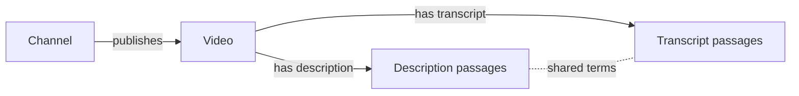

# Directed video-library graph for Tomeowl

Checked on 2026-10-05 against the installed QMD 2.8.3 and Graphify 0.9.75 source and their pinned upstream documentation.
This note recommends a model-free first graph and distinguishes ideas borrowed from the tools from those tools actually executing.
No third-party extraction, model inference, or external upload of Viberaven content was performed for this research.

## Recommendation

Use channel identity and video identity to build exact ownership edges, and chunk description and transcript text to expose useful evidence below each video.
Embeddings are optional for later discovery across those content chunks and are unnecessary for the ownership graph.
Keep structural facts and text-similarity suggestions as different relation types with different visual treatment.

The requested four layers are four node kinds, with description and transcript as sibling branches rather than one containing the other.
The ownership tree therefore has channel, video, and content as its three hierarchy depths.
If a content document is expanded into passages, those passages belong to the same description or transcript kind, rather than becoming an invented fifth semantic layer.

## What QMD contributes

QMD separates keyword `search`, vector `vsearch`, and hybrid `query`; the latter routes combine model-backed expansion, vectors and reranking. [Tagged QMD overview](https://github.com/tobi/qmd/blob/v2.8.3/README.md).
Its keyword route retrieves full documents using FTS5 BM25 with path/title/body weights of 1.5/4.0/1.0, rather than ranking canonical transcript cue nodes. [Tagged retrieval implementation](https://github.com/tobi/qmd/blob/v2.8.3/src/store.ts).
The embedding chunk target is 900 tokens with 135-token overlap, while its synchronous approximation uses 3,600 characters and 540-character overlap.
Break selection favors headings and paragraphs and avoids code-fence interiors, with source character positions retained. [Tagged chunk implementation](https://github.com/tobi/qmd/blob/v2.8.3/src/store.ts).
These settings are implementation defaults, not measured optimal video boundaries.
QMD-inspired chunk boundaries and native keyword ranking can be adopted without adding QMD as a product dependency.
An actual QMD comparison would need staged Markdown, an isolated keyword-only index, exact commands and emitted results; native lexical output alone is not a QMD result.

## What Graphify contributes

Graphify distinguishes local code AST extraction from a model-backed semantic pass over documents and media. [Pinned Graphify overview](https://github.com/Graphify-Labs/graphify/blob/48d7c0e832cd2d67d86850e716ddea16df6238ea/README.md).
Its CLI skips non-code semantic input under `--code-only` and requires a configured backend for non-code extraction. [Pinned extraction dispatch](https://github.com/Graphify-Labs/graphify/blob/48d7c0e832cd2d67d86850e716ddea16df6238ea/graphify/cli.py).
Consequently the prior AST benchmark cannot establish Graphify's transcript understanding or give a model-free recipe for extracting semantic concepts from captions.
The useful graph pattern is explicit relation names and provenance, with extracted facts separated from inferred connections. [Pinned Graphify overview](https://github.com/Graphify-Labs/graphify/blob/48d7c0e832cd2d67d86850e716ddea16df6238ea/README.md).
An embedding encoder provides similarity vectors, while a document-extraction model generates proposed entities and relations; those are different contracts even when a runtime can host both.
A local Graphify semantic comparison remains deferred until a model, offline runtime, extraction prompt and evidence-validation policy are chosen.

## Minimal content representation

| Node kind | Identity | Text evidence | Useful fields |
|---|---|---|---|
| Channel | Canonical channel ID, with a namespaced fallback when absent. | Stored channel metadata rather than inferred ownership. | Display name, canonical URL, video count and identity provenance. |
| Video | Platform plus video ID. | Stored video metadata and explicit channel association. | Title, URL, upload date when present, description/transcript availability and source revision. |
| Description | Video identity plus description revision and passage span. | Literal description paragraphs or bounded passages. | Character or line span, passage ordinal, text hash and extracted URL references. |
| Transcript | Video identity plus transcript revision and cue/passage span. | Literal contiguous caption cues. | Cue range, start/end seconds when present, language, generated-caption status and text hash. |

This table is the proposed Tomeowl representation and does not claim these fields already exist in every Viberaven record.
Choose the authoritative Viberaven source after inspecting its schema and stored file references, and record SQLite versus raw-file provenance in the export.
Do not mix conflicting transcript variants silently or import duplicate plain-text copies beside the same canonical timed JSON.
Unavailable descriptions, transcripts, timestamps and channel IDs need explicit availability or omission records rather than fabricated evidence.
Tomeowl already has current source revisions, chunk ordinals, literal quotes and line/time locators, which provide a useful evidence contract for this adapter. [Existing domain types](../../src/domain.ts), [existing transcript parser](../../src/ingest.ts).

## Chunking policy

Begin descriptions at paragraph boundaries and keep short descriptions intact.
Group transcript cues contiguously, preserve their original order, and prefer complete cue boundaries over cutting spoken text by arbitrary character count.
Use explicit character, cue-count, source-byte and total-corpus limits for this first model-free build, and label character limits as characters rather than model tokens.
Split an oversized cue with exact source subspans and preserve its original timing provenance, instead of claiming that each slice has a separately known timestamp.
Treat any overlap as a retrieval window recipe with recorded spans, and avoid creating lexical similarity edges merely because adjacent windows share their copied overlap.
Keep passage IDs stable for identical source revisions and spans, and preserve canonical channel/video IDs when the workspace moves between machines.
For a later embedding experiment, subdivide passages according to the selected tokenizer without replacing canonical evidence spans or silently truncating uncovered text.

## Directed and heuristic relations

| Relation | Direction | Basis | Evidence requirement |
|---|---|---|---|
| `publishes` | Channel to video. | Structural. | Stored channel/video association or explicitly documented fallback. |
| `has_description` | Video to description passage. | Structural. | Matching video identity and description revision/span. |
| `has_transcript` | Video to transcript passage. | Structural. | Matching video identity and transcript revision/cue span. |
| `next_passage` | Earlier passage to later passage in the same content source. | Sequence. | Original passage/cue ordinal, with timestamps included only when available. |
| `references` | Content passage to a recognized video or channel. | Explicit URL mention. | Literal URL and source span, with verified identifier resolution. |
| `shared_terms` | Symmetric association, displayed as a dashed connector. | Lexical heuristic. | Shared terms, declared score recipe and evidence from both current passages. |

Arrowheads show ownership, sequence and explicit reference direction.
Shared vocabulary does not establish causality, agreement, citation, or paraphrase equivalence, so similarity connectors should remain symmetric even inside a directed graph.
If a storage format requires a source and target for a symmetric relation, choose a deterministic ID order and retain an explicit symmetric flag.
Exclude boilerplate such as subscriptions, affiliate links and repeated channel marketing from the lexical score while retaining the original source text for evidence.
Bound candidate generation and keep only a small top set per passage, with minimum shared informative terms and a reported threshold.
Use inverse document frequency or an equally explicit corpus-aware weight so widespread transcript words cannot dominate every neighborhood.
Expose the shared terms and both source passages when selecting a heuristic edge, and label the result lexical rather than semantic.

## Checks before interpreting the graph

Verify every video belongs to its declared channel, every passage belongs to its video, and every relation endpoint exists.
Verify description quotes and transcript cue/time locators against the chosen current source bytes.
Report admitted channels/videos, available descriptions/transcripts, emitted passages, skipped records, capped records and content bytes.
Distinguish complete-source coverage from a bounded showcase so a visually dense graph is not presented as the whole library.
Check a handful of manually judged cross-video pairs and obvious unrelated pairs before assigning meaning to lexical clusters.
Keep existing UI views available and add this directed dataset through the smallest viewer seam that preserves the frozen graph controls.
The first successful result is an inspectable ownership/evidence graph with honest cross-links, not an unmeasured claim of semantic understanding.
