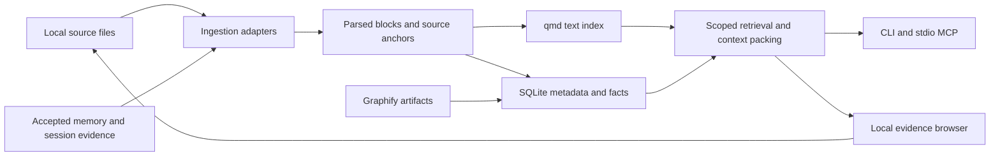

# Tomeowl plan for review

Status: architecture accepted for a prototype; implementation now targets local transcript/project mapping.
Updated: 2026-10-02, Asia/Kuala_Lumpur.
Confirmed: reuse existing qmd + Graphify first; research org2AI/ORG2 and Block Buzz.

## Prototype scope update

The user rejected the initial evidence-workbench presentation and requested research into the dark clustered spatial maps shown by RoboNuggets and Anthropic.
[RESEARCH-GRAPH-VISUALIZATION.md](RESEARCH-GRAPH-VISUALIZATION.md) traces the public dependency viewer; [NEXT-SPATIAL-PROTOTYPE.md](NEXT-SPATIAL-PROTOTYPE.md) specifies the proposed next slice.
The viewer and DESIGN.md now implement the dark spatial direction with deterministic clusters, named Rings, and located excerpt marks.
The headless retrieval and extraction engine is unchanged; [SPATIAL-REVIEW.md](SPATIAL-REVIEW.md) records the critic's rendered review iterations.

The user accepted Bun + SQLite, requested a portable single-binary CLI and map export, and deferred semiconductor work because the data is confidential.
The first corpus is Viberaven's supplied RoboNuggets transcripts plus bounded documentation from Viberaven, Tokenmill, and Firstmate.
The earlier `tp-agentkit` recommendation is withdrawn: metadata inspection was insufficient to establish useful content.
The reference video's transcript is now available locally; [RESEARCH-CREATOR.md](RESEARCH-CREATOR.md) supersedes the earlier transcript-availability limitation.
The video uses custom `brain.js` retrieval and cites qmd/GBrain/Graphify as references; it does not establish that the three are deployed together.
See [PROTOTYPE-ADAPTERS.md](PROTOTYPE-ADAPTERS.md) for actual local availability and deployment constraints.
The compiled executable packages the Tomeowl core and browser viewer; optional external adapters remain separate programs.
Desktop packaging and harness memory-write integration remain later possibilities.
The domain roadmap below is retained as future planning, not the current implementation scope.

## Recommendation

Build a local knowledge and memory tool that coordinates existing search and graph tools, preserves evidence, and presents useful relationships.
Use one workspace installation with a project registry rather than adding a stack inside every project.
Prioritize semiconductor source traceability alongside measurable context reduction for coding agents.
Do not start by rebuilding embeddings, adopting GBrain's database, or implementing an autonomous orchestrator.

The initial runtime recommendation is Bun/TypeScript with SQLite for Tomeowl metadata and structured facts, using qmd through a replaceable adapter and Graphify through its exported artifacts.
This fits the detected Windows environment and installed Bun/qmd better than immediately introducing a Rust inference engine.
Rust remains an option if measured packaging, memory, or concurrency problems justify it.
Pin dependencies only when implementation starts; no dependency installation is part of this review.

| Option | Added runtime/services | Reuses current tools | Portability | Decision |
|---|---|---|---|---|
| Bun coordinator + SQLite + adapters | Existing Bun; optional project-local parser environment | Yes | Windows first; test Linux paths and subprocesses | Recommended first slice |
| Rust core + qmd/Graphify adapters | Rust build plus existing tool runtimes | Yes | Good native core; still not a self-contained deployment | Reconsider after measured need |
| Adopt GBrain or a memory service | Separate schema/index/service lifecycle | Partially | Depends on selected backend and model services | Learn patterns; defer runtime adoption |
| Replace qmd + Graphify in Rust | New parsing, embedding, ranking and graph subsystems | No | Potential future single binary; much larger validation burden | Defer |

## What the research changes

[Baseline audit](RESEARCH-BASELINE.md), [memory-system review](RESEARCH-MEMORY.md), [ingestion review](RESEARCH-INGESTION.md), and [evaluation research](RESEARCH-EVALUATION.md) contain supporting sources and limits.
The original [RESEARCH.md](RESEARCH.md) is a historical hypothesis catalog; its detailed uncited claims are not implementation requirements.
The first research pass lacked the video transcript; the supplied Viberaven transcript has since been reviewed, while the cited 40% saving still has no verified local benchmark.
qmd is a Node/Bun application; Graphify is a Python tool with both deterministic code extraction and optional semantic extraction.
Orca's inspected local integration concerns runtime/worktree control; its memory implementation was not established.
Paperclip's inspected memory contract is a proposal, while ORG-2 advertises session traceability without exposing enough internals to reproduce its memory engine.
Block Buzz suggests durable events and audience-aware memory; richer memory services suggest lifecycle patterns rather than a mandatory new backend.

Recent studies make correction and revocation filtering a core requirement, rather than relying on a model to notice a stale note.
See [September revocation study](https://arxiv.org/abs/2609.08258) and [memory trust study](https://arxiv.org/abs/2609.01852); these are unreproduced preprints, not ATE accuracy evidence.

## Core responsibilities

| Layer | Owns | First implementation boundary |
|---|---|---|
| Sources and ingestion | Identity, revision, hash, page/line anchors, parser outputs, resumable jobs | Markdown/code plus a narrow digital-PDF adapter; originals remain local |
| Knowledge | Entities, numeric specifications, typed relationships, source evidence | SQLite records; imported Graphify graph artifacts; no separate graph database |
| Retrieval | Scope/revision filters, exact lookup, qmd results, bounded graph expansion, context packs | Cheap lexical/exact path first; optional semantic mode; stable JSON |
| Memory | Explicit accepted lessons, corrections, supersessions, source sessions | Human-readable notes and provenance; searchable on demand |
| Surfaces | CLI, stdio MCP, browser inspection | Shared headless core; local UI after retrieval is proved |

The adapter interface should expose capabilities, version, health, search, source resolution, import/update status, and bounded errors.
Never reach into qmd's internal SQLite schema or assume Graphify edges have identical confidence or source fidelity.
Use argument arrays and subprocess timeouts; avoid shell interpolation of user queries and paths.
SQLite stores derived metadata and facts, not a second copy of qmd's embeddings.
Indexes and extraction artifacts must be rebuildable from originals and accepted memory records.

## Scope and memory lifecycle

Register projects explicitly with stable IDs independent of path spelling or Git worktree location.
Use project, workspace/shared, and personal scopes; cross-project recall requires an explicit scope selection or approved shared collection.
Keep semiconductor/customer sources in separate collections with local-only defaults and no implicit external model calls.
Apply scope and source revision filters before ranking, graph traversal, and packing.

Store source knowledge, session evidence, accepted lessons, and linked procedures as distinct record kinds.
An agent suggestion is a candidate, not automatically an accepted engineering fact.
Each derived claim/edge records source ID and hash/revision, locator, extractor version, observation time, status, and whether it is deterministic, human-confirmed, or model-inferred.
Facts also need validity/operating conditions and supersession links.
Support explicit remember, correct, forget, and history inspection; deleted or superseded records cannot remain active through stale pack caches.
Hard deletion needs propagation through notes, indexes, artifacts, and caches; audit retention policy must be explicit.
Use a serialized write path, idempotent imports, atomic artifact replacement, and short transactions for concurrent agents.
Do not mutate the source files or installed search configuration during initial ingestion experiments.

Start with recall/search, resolve-source, context-pack, and explicit memory operations.
Treat the seven GBrain verbs as inspiration, not a compatibility promise.
Always-on prompt injection is optional and small; the primary integration is on-demand retrieval.
Pre-compaction hooks depend on the actual harness lifecycle API and are a later adapter, not a universally available MCP hook.
Scheduled consolidation remains optional until explicit memory proves useful.

## Semiconductor model and ingestion

Primary entities: device/product revision, pin, net, board revision, component/refdes, tester resource/channel, test suite/method, test identifier, and specification.
An illustrative path is test method -> pin -> board net -> component -> instrument resource, with a separate test -> specification relationship.
Every edge must be source-backed or visibly inferred; missing links stop a traversal rather than producing invented continuity.
Store electrical limits as structured min/typ/max values with units, conditions, footnotes, revision, and source table/cell coordinates.
Do not merge two values just because their normalized pin or test names match.

Ingestion is detect -> hash -> parse -> preserve blocks/tables/anchors -> validate -> index -> publish status.
Use bounded batches, failure isolation, cancellation, resumable checkpoints, and per-parser resource limits.
Digital PDFs precede scanned manuals; preserve page bounding boxes and table structure.
OCR and model-assisted diagram extraction are optional plugins with explicit model/data-flow choices.
Prefer EDA netlists or connectivity exports for schematics; PDF graphics/OCR alone do not establish electrical connectivity.
ATE program formats need format-specific parsers after sample discovery, rather than assuming generic C++ parsing recovers test flows and pin maps.
STDF analytics, wafer maps, and automated root-cause diagnosis are later extensions; this first scope relates documents and programs.

## Presentation and visualization brief

Audience: one engineer or coding agent tracing a question to trustworthy evidence across projects and engineering documents.
Mode: Operate, with Read behavior in the source inspector.
Primary outcome: find and verify the relationship or specification, then export a compact cited context pack.
The recommended structural concept is an evidence workbench: scoped results, a focused relationship path, and a synchronized source inspector.
Visual identity is still open for review; this proposal does not select a final theme.

| View | Question it answers | Behavior |
|---|---|---|
| Search and evidence | Where is the relevant source? | Query, project/product/revision filters, exact-match hints, short snippets, source anchors |
| Focused relationship path | How are this test, pin, net, and spec connected? | Expand selected neighborhoods with node/depth caps; edge click opens its evidence |
| Spec comparison | Which limit applies, and what changed? | Table of values/units/conditions/revisions with conflicts and missing conditions exposed |
| Source inspector | Can I verify this extraction? | Code lines or PDF page with highlights, table view, parser warnings, source revision |
| Memory and ingestion review | What changed or needs attention? | Candidate lessons, supersessions, failed jobs, stale sources, rebuild/retry status |

Global graph overview is optional; the initial graph defaults to a small selected neighborhood and a readable path/list alternative.
Unknown, inferred, stale, conflicted, and verified states must be distinguishable without color alone.
Support keyboard navigation, expandable long identifiers, stable selection, and copy/export with citations.
Do not fabricate engineering evidence for visual polish; sample screenshots must label synthetic data.
Desktop browser is the first surface; avoid Electron/Tauri until a native requirement appears.

## Delivery sequence and review gates

| Phase | Deliverable | Exit evidence |
|---|---|---|
| 0: corpus and baseline | Read-only manifest, exclusions, representative queries and annotated expected sources; adapter capability checks | qmd/Graphify versions and actual outputs verified; private sources stay local; baseline reproducible |
| 1: retrieval core | Bun core, SQLite metadata, qmd adapter, Graphify artifact importer, stable CLI JSON and context pack | Correct project/revision filtering; resolvable citations; bounded graph expansion; missing evidence reported |
| 2: semiconductor slice | Narrow PDF/table and program/netlist ingestion; structured limits and source-backed relationships | Reviewed golden fixtures; exact identifiers/units/conditions correct; reimport and revision changes handled |
| 3: evidence workbench | Search, source inspector, focused graph, spec comparison | Complete one real traceability task; responsive desktop layout and keyboard use verified |
| 4: memory and harness integration | Explicit memory lifecycle, stdio MCP, session adapter | Correction/forget propagation; concurrent-write tests; compact tool payloads measured |

Phase 0 precedes dependency and UI framework selection.
Phase 1 and Phase 2 form the first useful end-to-end proof; later scope depends on their results.
Each phase ends with a reviewable artifact and a decision to continue, revise, or stop.
No daemon, automatic source sweep, cloud sync, autonomous memory promotion, or scheduled model calls are necessary for the first proof.

## Verification and targets

Recommended local sample: `D:\Dev\tp-agentkit`, selected from read-only file and ZIP-directory metadata.
Its visible corpus has 28 files and packaged code/documentation, but no representative PDF manuals or EDA schematic files.
Phase 0 should inspect a bounded local subset of its Markdown/workflow material, exclude secrets/customer-sensitive paths, and annotate actual expected sources before indexing.
Use a separate small software repository such as `D:\Dev\WSGen` for code-navigation cases if its content review confirms suitability.
Do not treat Python/tooling found in archive metadata as proof of a real proprietary ATE program corpus.
Use labeled synthetic manual, datasheet, program, and netlist fixtures to exercise the full relationship path; later real samples determine supported dialects and parser choices.

Use the protocol in [RESEARCH-EVALUATION.md](RESEARCH-EVALUATION.md): matched corpus/models/budgets, separate retrieval and answer scoring, cold/warm latency, and ingestion/write costs.
Start with 30 reviewed cases across software, semiconductor relationships, revisions/conflicts, and missing evidence; hold out questions from tuning.
Compare current file search and qmd + Graphify with qmd alone and Tomeowl orchestration.
Aim for 30% smaller packed context without worse evidence recall, but claim no saving before measurement.
Require correct source resolution and no active wrong-scope/revoked evidence in the negative tests.
Include long paths, spaces, mixed line endings, source edits, duplicate imports, canceled jobs, concurrent writes, and parser failures.
Use synthetic fixtures for missing manual/schematic/datasheet families and state exactly which real-world claims they cannot validate.

## Review decisions

1. Confirm the proposed Bun coordinator + SQLite metadata approach, with qmd/Graphify retained behind adapters.
2. Confirm the first domain proof focuses on manual/program/pin/net/spec traceability, postponing STDF analytics.
3. Review the proposed dark clustered map and evidence/list interactions before UI implementation.
4. Identify the ATE platform/program format and allowed data flow for real manuals; default is entirely local with model-assisted extraction off.
5. Review the corpus recommendation in RESEARCH-INGESTION.md and the evaluation gates before source indexing begins.

Environment observed: Windows 10.0.26200, PowerShell 7.6.5, Bun 1.4.2, Node 24.19.0, uv 0.12.17, Cargo 1.98.0, qmd 2.8.3.
Graphify did not resolve as a command in this shell; this does not establish that it is absent from project environments.
The working directory has no Git repository; this turn creates research/planning documents without source cutover.
Before implementation or replacement of existing artifacts, initialize version control or verify a rollback snapshot.
Runtime metadata identifies Codex on a Plus account; an exact coordinator model identifier and dollar cost are not exposed.
Luna high/xhigh subagents were used as requested; native usage was checked at start and synthesis.

## Prototype checkpoint

Done: `src/core.ts`, `src/adapters.ts`, `src/cli.ts`, and `src/viewer.html` implement bounded caption/project ingestion, SQLite search, evidence graph export, an offline viewer, and optional external adapters.
`dist/tomeowl.exe` compiled successfully for Windows x64 and returned two qmd-related SQLite hits with Bun absent from PATH in a single 84 ms smoke run; this is not a benchmark distribution.
The scratch corpus contains 24 videos, three projects/five project documents, 11,095 caption/line chunks, 38 nodes, and 51 relationships.
The focused smoke script passes source/graph integrity, reference video, project coverage, retrieval, and HTML escaping checks; a missing-DB search fails without creating the database.
qmd indexed 32 derived evidence documents and returned the reference video plus related sources; no embedding/model download or API spend occurred.
A separate Graphify snapshot map imports 80 nodes/225 relationships with explicit unverified-revision warnings.
GBrain is not installed; its optional adapter has not been exercised.
Desktop/mobile browser checks and the fresh reviewer confirmed the listed edge-selection and documentation fixes; see [PROTOTYPE-REVIEW.md](PROTOTYPE-REVIEW.md).
The foreground preview is available at `http://127.0.0.1:4317`; the standalone HTML needs no server.
Sibling project contents were not changed.

Remaining limits: channel-specific ingestion, corpus replacement rather than incremental indexing, lexical topic extraction with a small known alias list, limited browser-search coverage, no verified semantic relationships, no desktop wrapper, and no harness memory-write/MCP integration.
The original semiconductor roadmap is deferred.
No token-savings claim has been measured.

Next: review the generated map's usefulness and relationship/evidence gaps before broadening ingestion or adding durable memory updates.
