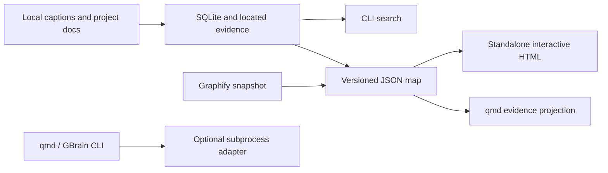

# Tomeowl prototype

Tomeowl is a local evidence-map prototype with a Bun/SQLite core, a compiled Windows CLI, and a self-contained interactive HTML viewer.
Its current demo maps 24 supplied RoboNuggets transcripts plus documentation from Viberaven, Tokenmill, and Firstmate.
The demo contains 38 nodes and 51 source-backed relationships; topic mentions do not establish integrations.
Semiconductor sources are excluded.

## Try it

Open [the standalone map](prototype-data/map.html), or run the compiled CLI from this workspace:

```powershell
D:\Dev\tomeowl\dist\tomeowl.exe serve --db D:\Dev\tomeowl\prototype-data\prototype.sqlite --port 4317
```

Then open http://127.0.0.1:4317 in a browser.
The server runs in the foreground and serves a snapshot; restart after rebuilding/reingesting.
The HTML file can also be opened directly without the server.

Search timestamped evidence without a browser:

```powershell
D:\Dev\tomeowl\dist\tomeowl.exe search --db D:\Dev\tomeowl\prototype-data\prototype.sqlite --query qmd --limit 5
```

Rebuild the executable using the existing Bun 1.4.2 installation:

```powershell
bun run build
```

No package installation or model download is required.
The executable is approximately 82 MiB because it includes the runtime and SQLite.
It is a Windows x64 build; other OS/architecture targets need separate builds.
Data is outside the executable; `demo` uses this machine's sample paths, while `ingest` accepts explicit paths.
This is exploratory code and a scratch database, not a validated production KB.

## Commands and portability

`demo`, `ingest`, `search`, `export`, `project`, `serve`, `doctor`, and `adapter` expose non-interactive CLI entry points.
Run `tomeowl.exe --help` for arguments and bounds.
`ingest` replaces the prototype corpus in one transaction; it is not an incremental multi-project registry.
Transcript ingestion currently recognizes the RoboNuggets channel layout, with a maximum of 40 videos.
SQLite BM25 searches all imported caption/line chunks; the browser searches titles, topics, excerpts, and extracted evidence only.
The spatial viewer offers clustered and ring layouts, pan/zoom, fit, search, labels, a keyboard-accessible source list, a searchable Commands palette, and a persistent desktop action deck for the bounded imported corpus.
The workspace groups current-map sources by local project and occupied topic group, shows collection counts, and keeps a local/offline status strip visible.
Optional interface sounds are off by default and play short selection, layout, import-success, and import-error cues only after the user enables them.
Cluster keeps anchors and excerpt-owning sources fixed; bare terminal sources and excerpt marks orbit at a 105-second cycle with Orbit speed 25 by default.
Rings rotates the source categories and attached marks on 300–350-second cycles.
The accessible Orbit speed range is 0–100; zero holds the map pose while actions can still morph layouts or fit the camera.
Glow toggles cached node blooms and relationship focus.
Recorded excerpts stay attached to their moving sources, and layout changes morph source identities over 820 ms with 420 ms camera moves.
The Motion control freezes the current displayed frame; motion also pauses for hidden tabs and active gestures, and the system reduced-motion preference starts the map still.
Live checks confirmed the Motion-off frame counter stayed at 1700 and a moving hit target opened the recorded Impeccable excerpt at 6:38 with its safe URL at 398 seconds; corpus/import checks and executable compilation passed.
The [latest motion recording](prototype-data/review/motion-demo-v2.mp4) captures 11.709 seconds in 160 frames (about 14 fps), encoded to 11.76 seconds; viewer animation is capped at 30 fps.
Smaller evidence marks represent recorded excerpts, counted separately from canonical source/topic/project entities.
Node and edge selection open evidence; timestamp links resolve to original videos.
Unknown topics and relationships are not automatically inferred.
The schemaVersion 1 JSON snapshot is the hand-off artifact for future web/desktop surfaces.
CLI JSON and read-only `/api/map` and `/api/search?q=...` routes provide a small harness-facing read contract.
Two-way agent memory updates and MCP are future work.

## External tools

| Tool | Implemented boundary | Current proof/limit |
|---|---|---|
| qmd | Derived Markdown evidence projection and explicit subprocess search | 32 documents indexed in Tomeowl's own `.qmd`; lexical search returned the reference video and related sources. No embeddings downloaded. |
| Graphify | Existing graph.json importer via export `--graphfile` and `--root` | Separate [snapshot map](prototype-data/graphify-map.html) includes 80 imported nodes. Its checkout/revision is unverified and visibly labeled. Graphify executable is not installed on PATH. |
| GBrain | Optional CLI resolution and explicit search dispatch | Not installed on PATH; runtime integration has not been exercised. Its memory lifecycle informed the design. |

The external tools are not bundled into Tomeowl's executable.
The core search and map export work when Bun/qmd/GBrain/Graphify do not resolve on PATH.
The qmd adapter uses a direct installed Bun entrypoint on Windows when available to avoid shell interpolation in the global shim.
The Codex process sandbox blocked child-process spawning; the adapter succeeded under approved execution.
For the isolated qmd setup, `QMD_CONFIG_DIR` points to `D:\Dev\tomeowl\prototype-data\qmd-config`; no global trust/config file was changed.
The projection includes extracted evidence, not the complete transcript archive, and must be regenerated when the corpus changes.
Sibling repositories and transcript artifacts were read only.

## Structure

```text
src/core.ts           Bounded ingestion, SQLite/FTS, evidence graph
src/adapters.ts       Graphify artifact import, qmd projection
src/cli.ts            CLI, optional adapters, loopback preview
src/viewer.html       Offline interactive viewer embedded at compile time
scripts/check.ts      Focused corpus/export smoke checks
prototype-data/       Generated scratch DB/maps/corpus/screenshots (ignored)
dist/tomeowl.exe      Compiled Windows executable (ignored)
```



## Research and verification

[Recent second-brain research](RESEARCH-SECOND-BRAIN-RECENT.md) records the pinned last30days skill run and dated source checks.
[Command-center research](RESEARCH-COMMAND-CENTER.md) compares the two supplied videos and recommends a workspace built from existing Tomeowl collections, map actions, and evidence.
[Clustered-map research](RESEARCH-GRAPH-VISUALIZATION.md) traces Anthropic's public D3/Canvas dependency viewer.
[The spatial prototype specification](NEXT-SPATIAL-PROTOTYPE.md) records the user's requested dark clustered map and its evidence boundaries.
The dependency-free Canvas renderer uses deterministic placement; the Anthropic viewer informed the interaction research, without vendored source or D3 dependencies.

[Creator research](RESEARCH-CREATOR.md) uses the supplied reference transcript and public first-party sources.
The video describes custom brain.js retrieval; qmd, GBrain, and Graphify are design references, not a demonstrated combined runtime.
The named research skill is last30days; frontend-design, visualize, code-modernize, and Impeccable were not confirmed as components of that build.
The R65 implementation kit is behind the creator's private Skool community; its code/schema remain unverified.
See [adapter feasibility](PROTOTYPE-ADAPTERS.md), [initial prototype review](PROTOTYPE-REVIEW.md), [spatial critic reviews](SPATIAL-REVIEW.md), and [the revised plan](PLAN.md).
Earlier [baseline](RESEARCH-BASELINE.md), [memory](RESEARCH-MEMORY.md), [ingestion](RESEARCH-INGESTION.md), and [evaluation](RESEARCH-EVALUATION.md) notes remain available; [RESEARCH.md](RESEARCH.md) is historical pre-research.

Verified: demo import, repeat import, graph integrity, evidence references, SQLite retrieval, HTML escaping, Windows compilation, executable search without Bun on PATH, qmd lexical search, Graphify snapshot import, and desktop/mobile interactions.
No claim of token savings, semantic accuracy, arbitrary repository understanding, or workplace approval is made.

Done: runnable portable-core prototype and offline clustered/Rings evidence viewer.
Next: assess retrieval usefulness and ingestion depth before adding durable memory writes or desktop packaging.
